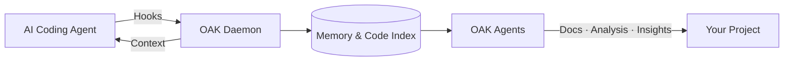

# Open Agent Kit

[](https://github.com/goondocks-co/open-agent-kit/actions/workflows/pr-check.yml)
[](https://github.com/goondocks-co/open-agent-kit/actions/workflows/release.yml)

[](https://pypi.org/project/oak-ci/)
[](https://www.python.org/)
[](LICENSE)

**Your Team's Memory in the Age of AI-Written Code**

You architect. AI agents build. But the reasoning, trade-offs, and lessons learned disappear between sessions. OAK records the full development story — plans, decisions, gotchas, and context — creating a history that's semantically richer than git could ever be. Then autonomous OAK Agents and Skills turn that captured intelligence into better documentation, deeper insights, and ultimately higher quality software, faster.




## Quick Start

```bash
# Install (macOS / Linux)
curl -fsSL https://raw.githubusercontent.com/goondocks-co/open-agent-kit/main/install.sh | sh

# Initialize your project
oak init

# Start the daemon
oak ci start --open
```

> **Windows?** See [QUICKSTART.md](QUICKSTART.md) for PowerShell install and other methods (pipx, uv, pip).

Then talk to your agent naturally — OAK skills activate automatically:

```
You:   "We need coding standards for this project"
Agent: (activates /project-governance) → creates oak/constitution.md

You:   "What did we decide about the caching approach last week?"
Agent: (activates /codebase-intelligence) → queries session history and memories

You:   "I'm refactoring AuthService — what else might break?"
Agent: (activates /codebase-intelligence) → runs semantic impact analysis

You:   "Create an RFC for migrating to PostgreSQL"
Agent: (activates /project-governance) → scaffolds RFC from template
```

> **[Full documentation](https://goondocks-co.github.io/open-agent-kit/)** | **[Quick Start](QUICKSTART.md)** | **[Contributing](CONTRIBUTING.md)**

## Supported Agents

| Agent | Hooks | MCP | Skills |
|-------|-------|-----|--------|
| **Claude Code** | Yes | Yes | Yes |
| **Gemini CLI** | Yes | Yes | Yes |
| **Cursor** | Yes | Yes | Yes |
| **Codex CLI** | Yes (OTel) | Yes | Yes |
| **OpenCode** | Yes (Plugin) | Yes | Yes |
| **Windsurf** | Yes | No | Yes |
| **GitHub Copilot** | Limited | No | Yes |

## Contributing

See [CONTRIBUTING.md](CONTRIBUTING.md) for the contributor guide and [oak/constitution.md](oak/constitution.md) for project standards.

```bash
git clone https://github.com/goondocks-co/open-agent-kit.git
cd open-agent-kit
make setup && make check
```

## Security

See [SECURITY.md](SECURITY.md) for the vulnerability reporting policy.

## License

[MIT](LICENSE)
