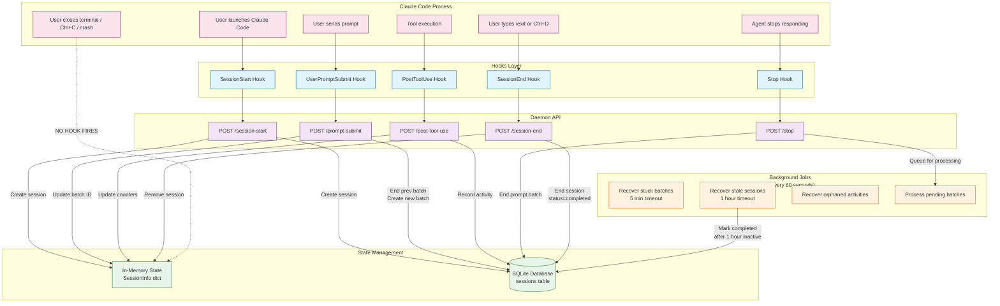
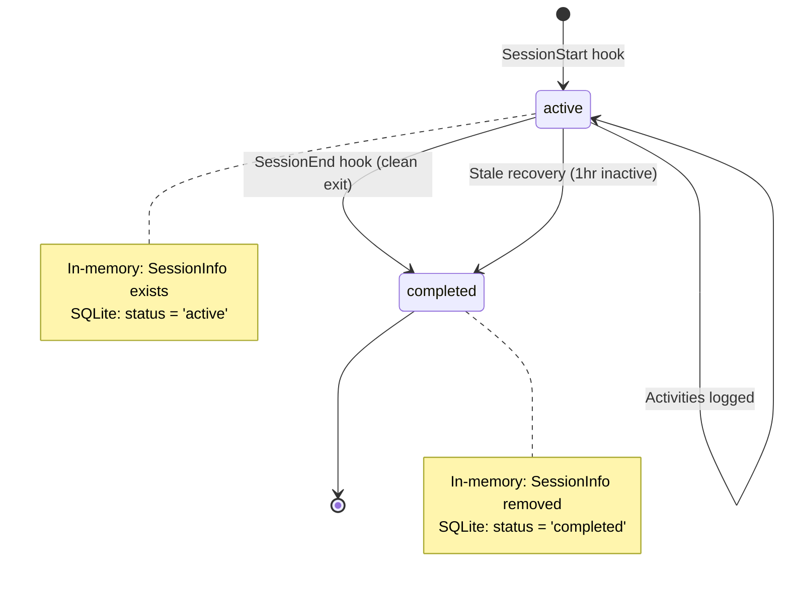
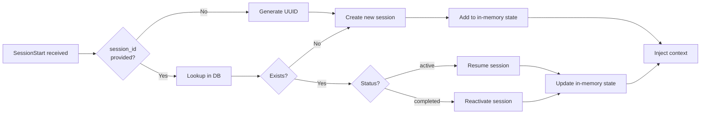

# Session Lifecycle Architecture

This document describes the complete session lifecycle for Codebase Intelligence, including hooks, events, background jobs, and state management.

## Overview

Sessions track all activity within an agent invocation. While the diagrams reference Claude Code,
the same lifecycle applies to Cursor and Gemini via equivalent hook events. The lifecycle is driven by:

1. **Hooks** - Events fired by the agent that we respond to
2. **Background Jobs** - Periodic cleanup and processing tasks
3. **State Management** - Dual tracking in memory and SQLite

## Lifecycle Diagram



## Session States



## Hook Events

| Hook | When Fired | What We Do | Notes |
|------|------------|------------|-------|
| `SessionStart` | Claude Code launches | Create session in memory + DB, inject context | Includes `source`: startup, resume, clear, compact |
| `UserPromptSubmit` | User sends a prompt | End previous batch, create new batch, search context | Creates prompt batches for grouping activities |
| `PostToolUse` | After each tool runs | Record activity to DB, update counters | Liberal capture for LLM processing |
| `Stop` | Agent finishes responding | End current prompt batch, queue for processing | Triggers async observation extraction |
| `SessionEnd` | Clean exit (/exit, Ctrl+D) | End session, generate summary | **BUG: May not fire reliably** |

## Background Jobs

All jobs run every 60 seconds via `schedule_background_processing()`:

### 1. Recover Stuck Batches
- **Timeout**: 5 minutes (`BATCH_ACTIVE_TIMEOUT_SECONDS`)
- **Condition**: Prompt batch with `status='active'` and no activity for 5+ minutes
- **Action**: Mark batch as `status='completed'`

### 2. Recover Stale Sessions
- **Timeout**: 1 hour (`SESSION_INACTIVE_TIMEOUT_SECONDS`)
- **Condition**: Session with `status='active'` AND:
  - Has activities: `last_activity < cutoff` (1 hour ago)
  - No activities: `created_at_epoch < cutoff` (created 1+ hour ago)
- **Action**: Mark session as `status='completed'`
- **Purpose**: Handles unclean exits where SessionEnd never fires

### 3. Recover Orphaned Activities
- **Condition**: Activities with `prompt_batch_id = NULL`
- **Action**: Associate with most recent batch or create recovery batch

### 4. Process Pending Batches
- **Condition**: Completed batches not yet processed
- **Action**: Send to LLM for observation extraction, store to ChromaDB

## Session Start Behavior

When a new session starts:

1. **We do NOT close other active sessions** - Multiple concurrent sessions are valid (multiple terminal windows)
2. **We create a new session** with unique UUID
3. **If same session_id provided** (e.g., daemon restart), we resume the existing session
4. **Context is injected** based on `source` parameter:
   - `startup`: Full context (memories, stats)
   - `resume`: Minimal context
   - `clear`/`compact`: Varies



## Known Issues

### SessionEnd Hook Not Firing
**Status**: Under investigation

Even when using `/exit` to cleanly close Claude Code, the SessionEnd hook does not appear to fire. The hook is correctly configured in `.claude/settings.json` and the endpoint works when tested manually.

**Workaround**: The stale session recovery job (1-hour timeout) will eventually close orphaned sessions.

**Investigation needed**:
- Verify Claude Code actually fires SessionEnd events
- Add logging to hook command to diagnose failures
- Consider opening a bug report with Anthropic

### State Synchronization
In-memory state and SQLite database can become desynchronized if:
- Daemon restarts mid-session (in-memory state lost)
- Stale recovery marks session completed while still active in memory

**Mitigation**: Activities continue to log based on session_id regardless of database status.

## Configuration

Key constants in `constants.py`:

```python
SESSION_INACTIVE_TIMEOUT_SECONDS = 3600  # 1 hour
BATCH_ACTIVE_TIMEOUT_SECONDS = 300       # 5 minutes
BACKGROUND_PROCESSING_INTERVAL = 60      # seconds
```

## Debugging

### Check session states
```bash
sqlite3 .oak/ci/activities.db "SELECT id, status, started_at, ended_at FROM sessions ORDER BY started_at DESC LIMIT 5;"
```

### Check daemon logs for lifecycle events
```bash
grep -E "Session start|Session end|Recovered" .oak/ci/daemon.log | tail -20
```

### Manually test SessionEnd
```bash
echo '{"session_id":"test-123","agent":"claude"}' | curl -s -X POST http://localhost:PORT/api/oak/ci/session-end -H 'Content-Type: application/json' -d @-
```

### Force close a session
```bash
sqlite3 .oak/ci/activities.db "UPDATE sessions SET status='completed', ended_at=datetime('now') WHERE id='SESSION_ID';"
```
