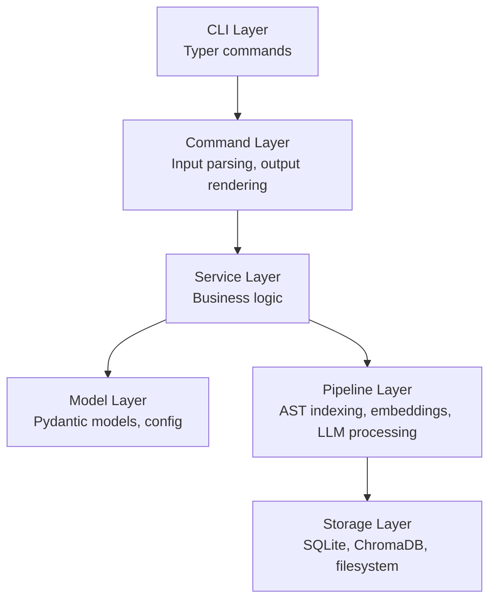
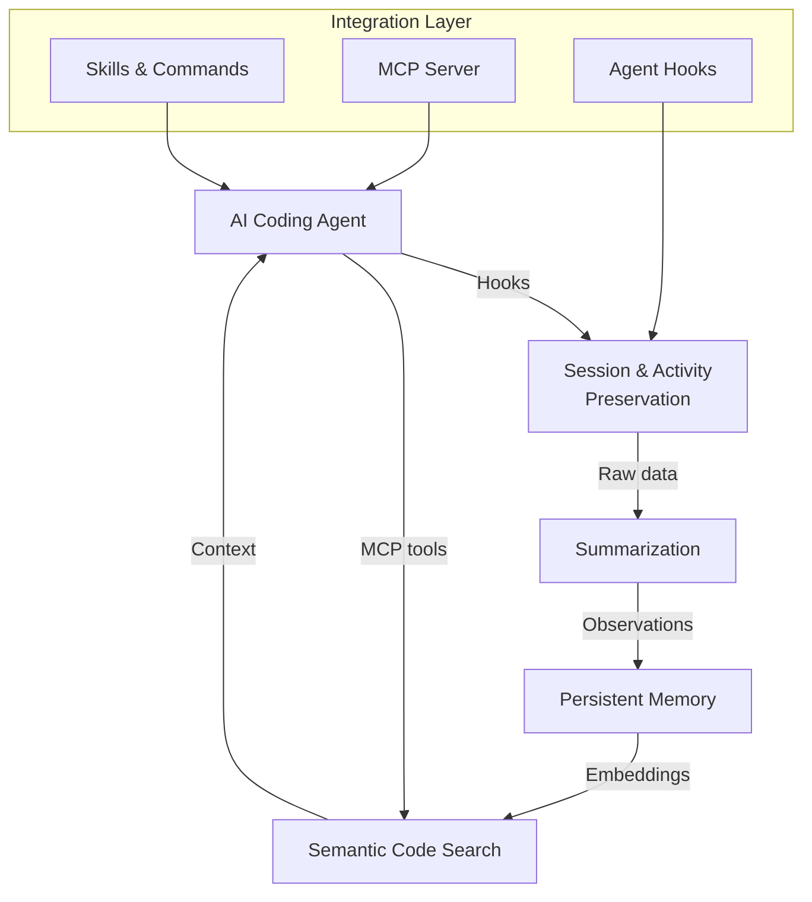
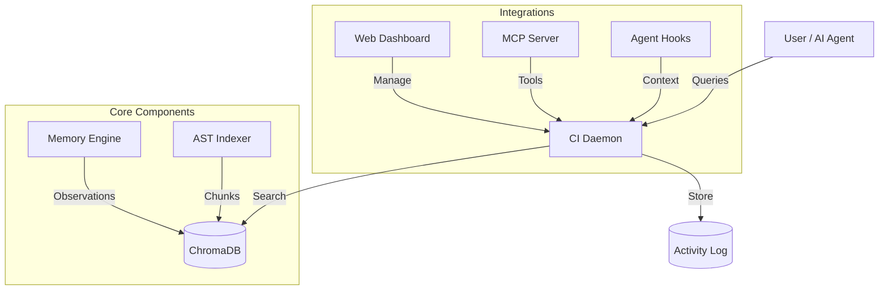

# Architecture

> System design, layers, and design principles of Open Agent Kit.
> This is contributor documentation — for user-facing docs see the [documentation site](https://goondocks-co.github.io/open-agent-kit/).

## Overview

Open Agent Kit (OAK) is a local-first CLI tool that gives AI coding assistants persistent memory and semantic code search. It runs as a background daemon, indexing your codebase and recording decisions so agents don't repeat mistakes across sessions.

## System Layers

OAK follows a strict layered architecture. Each layer depends only on the layer below it.



| Layer | Responsibility | Key files |
|-------|---------------|-----------|
| **CLI** | Entry points, argument parsing | `src/open_agent_kit/cli.py` |
| **Command** | Thin wrappers: parse inputs, call services, render output | `src/open_agent_kit/commands/` |
| **Service** | Business logic, orchestration | `src/open_agent_kit/services/` |
| **Model** | Data models, configuration schemas | `src/open_agent_kit/models/` |
| **Pipeline** | AST chunking, vector embeddings, LLM classification | `src/open_agent_kit/features/codebase_intelligence/` |
| **Storage** | SQLite (transactional), ChromaDB (vector search), filesystem | `.oak/ci/` |

## Core Capabilities

OAK's value comes from five interconnected capabilities:



| Capability | What it does |
|-----------|-------------|
| **Session & Activity Preservation** | Captures every prompt, tool execution, and agent output. Records session lineage (parent-child relationships) and tracks session state across compact/resume cycles. |
| **Summarization** | LLM-powered processing of sessions and plans. Generates titles, summaries, and extracts observations (gotchas, decisions, discoveries) from raw session data. |
| **Persistent Memory** | Observations, decisions, and gotchas preserved across sessions as vector embeddings. Agents retrieve relevant memories automatically via context injection. |
| **Semantic Code Search** | AST-aware indexing using tree-sitter for 13 languages. Code is chunked at function/class boundaries and stored as vector embeddings for natural language search. |
| **Skills, Commands, MCP** | The integration layer that connects OAK to coding agents. Hooks capture activity, MCP tools expose search/remember/context, and skills provide slash commands. |

## Codebase Intelligence

The CI daemon runs locally and provides the core runtime:



**Core components:**

| Component | Purpose |
|-----------|---------|
| **AST Indexer** | Tree-sitter-based code chunking for 13 languages |
| **Memory Engine** | Stores observations (gotchas, decisions, bug fixes) as vector embeddings |
| **Retrieval Engine** | Semantic search across code and memories |
| **Agent Hooks** | Auto-capture agent activity and inject relevant context |
| **MCP Server** | Exposes `oak_search`, `oak_remember`, `oak_context` tools |
| **Web Dashboard** | Visual interface for search, memory management, and debugging |
| **OAK Agents** | Agent SDK-powered agents for automated tasks (documentation, etc.) |

**Storage:**

| Store | Purpose | Location |
|-------|---------|----------|
| SQLite | Sessions, prompts, observations, activities (source of truth) | `.oak/ci/activities.db` |
| ChromaDB | Vector embeddings for semantic search | `.oak/ci/chroma/` |
| Backup files | Portable SQL dumps for team sharing (git-tracked) | `oak/history/` |

## Project Layout

```
open-agent-kit/
  src/open_agent_kit/
    cli.py                    # CLI entry point (Typer)
    constants.py              # Shared constants
    commands/                 # Command layer
    services/                 # Service layer
    models/                   # Pydantic models
    agents/                   # Agent definitions (claude, copilot, cursor, etc.)
      <agent>/manifest.yaml   # Agent capabilities and config
    features/                 # Feature modules
      codebase_intelligence/  # CI daemon, indexer, memory, hooks
      rules_management/       # Constitution management
      strategic_planning/     # RFC workflow
  oak/                        # User content (git-tracked)
    constitution.md           # Project constitution
    rfc/                      # RFC documents
    agents/                   # Custom agent task definitions
    history/                  # CI backups for team sharing
    insights/                 # Analysis agent reports
    docs/                     # Documentation agent output
    daemon.port               # Shared daemon port
  .oak/                       # Local state (not git-tracked)
    config.yaml               # Project configuration
    ci/                       # SQLite DB, ChromaDB, logs
```

## Design Principles

1. **Local-first**: Prefer local LLMs, local embedding models, local storage. Network integrations are allowed but never required for core usage.
2. **Idempotence by default**: Commands are safe to re-run. `oak init` and `oak upgrade` never break existing projects.
3. **Templates are owned by OAK**: Templates shipped by OAK are managed by OAK and overwritten on upgrade. No user-owned template overrides.
4. **No magic literals**: No magic strings or numbers anywhere, including tests.
5. **Proper engineering always**: Fix root causes, not symptoms. Prefer correct foundations over shortcuts.
