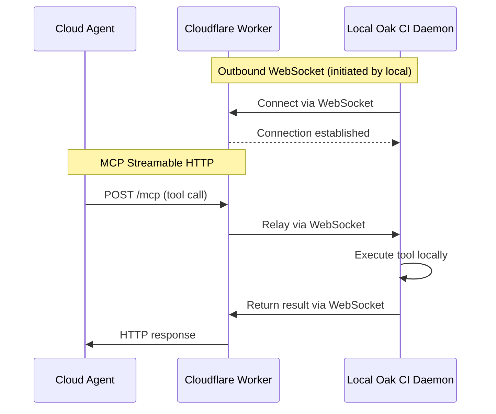

**Cloud Relay** connects cloud-hosted AI agents (Claude.ai, ChatGPT, and others) to your local Oak CI daemon through a secure WebSocket relay running on Cloudflare Workers. Your codebase never leaves your machine — only MCP tool calls and their results travel through the relay.

## The Problem

Oak CI's MCP tools are powerful, but they run on your local machine. Cloud-based AI agents like Claude.ai and ChatGPT can't reach `localhost`. Traditional solutions — public tunnels, VPNs, port forwarding — are complex, fragile, and introduce security risks.

Cloud Relay solves this with a lightweight Cloudflare Worker that acts as a secure bridge: cloud agents send MCP requests to the Worker, and the Worker relays them to your local daemon over a persistent WebSocket connection.

## How It Works

The key insight is that **your local daemon initiates the connection outward** — no inbound ports, no firewall rules, no dynamic DNS. The Cloudflare Worker simply relays messages between the two sides.

### Architecture

| Component | Role | Runs On |
|-----------|------|---------|
| **Cloudflare Worker** | Accepts MCP requests from cloud agents, relays to local daemon | Cloudflare's edge network (your account) |
| **Durable Object** | Manages WebSocket state and message routing | Cloudflare (co-located with Worker) |
| **WebSocket Client** | Maintains persistent outbound connection to Worker | Your local machine (inside Oak CI daemon) |

### Turnkey Deployment

Cloud Relay uses a **turnkey deployment model** — a single command (or button click) handles the entire pipeline:

1. Scaffolds a Cloudflare Worker project in `oak/cloud-relay/`
2. Installs npm dependencies
3. Verifies Cloudflare authentication
4. Deploys the Worker via `wrangler`
5. Connects the local daemon over WebSocket

Subsequent runs skip already-completed phases. For example, if the Worker is already deployed, clicking "Start Relay" simply reconnects the WebSocket.

### Multi-Project Model

Each project gets its own Worker deployment. This keeps tokens, state, and billing isolated per-project. A typical developer workflow:

1. Deploy one Worker per project you want to expose
2. Each Worker has its own pair of authentication tokens
3. Each local daemon connects to its project's Worker

## What Gets Exposed

Cloud Relay exposes all MCP tools registered with your local Oak CI daemon. This includes:

- **Code search** — Semantic and keyword search across your codebase
- **Memory** — Project observations, gotchas, decisions, and learnings
- **Context** — Task-relevant context aggregation
- **Activity history** — Session and activity browsing

The relay does **not** expose the full Oak CI web dashboard or direct filesystem access. Cloud agents interact exclusively through the structured MCP tool protocol.

## Cloud Relay vs. Tunnels

| | Cloud Relay | Traditional Tunnel |
|---|---|---|
| **Exposes** | MCP tools only | Full UI and all endpoints |
| **Direction** | Outbound WebSocket (no inbound ports) | Inbound connection (requires port/DNS) |
| **Auth** | Two-token model (relay + agent) | Varies (often IP-based or basic auth) |
| **Infrastructure** | Cloudflare Workers (serverless) | Tunnel service (ngrok, Cloudflare Tunnel, etc.) |
| **Cost** | Free tier is sufficient | Varies by provider |
| **Use case** | Cloud AI agents calling MCP tools | Sharing full dashboard with remote users |

## Cost

Cloud Relay runs entirely within Cloudflare's free tier for typical developer usage:

| Resource | Free Tier Limit | Typical Usage |
|----------|----------------|---------------|
| Worker requests | 100,000/day | ~500-2,000/day |
| Worker CPU time | 10ms/request | ~2-5ms/request |
| Durable Object requests | 100,000/day | ~500-2,000/day |
| Durable Object storage | 1 GB | < 1 KB |
| WebSocket messages | Unlimited | ~1,000-5,000/day |
| Egress bandwidth | Free | All |

No credit card is required. The free tier comfortably handles a single developer's workload with significant headroom.

## Prerequisites

Before setting up Cloud Relay, you need:

- **Oak CI** installed and running (`oak ci start`)
- **Cloudflare account** (free) — see [Cloudflare Setup](/open-agent-kit/features/cloud-relay/cloudflare-setup/)
- **Node.js** (v18+) for `npm` and the `wrangler` CLI
- A cloud AI agent that supports MCP Streamable HTTP (Claude.ai, ChatGPT, etc.)

## Next Steps

1. **[Cloudflare Setup](/open-agent-kit/features/cloud-relay/cloudflare-setup/)** — Create your free account and install wrangler
2. **[Getting Started](/open-agent-kit/features/cloud-relay/getting-started/)** — Deploy your first relay in one command
3. **[Cloud Agents](/open-agent-kit/features/cloud-relay/cloud-agents/)** — Register cloud AI agents with your relay
4. **[Authentication](/open-agent-kit/features/cloud-relay/authentication/)** — Understand the two-token security model
