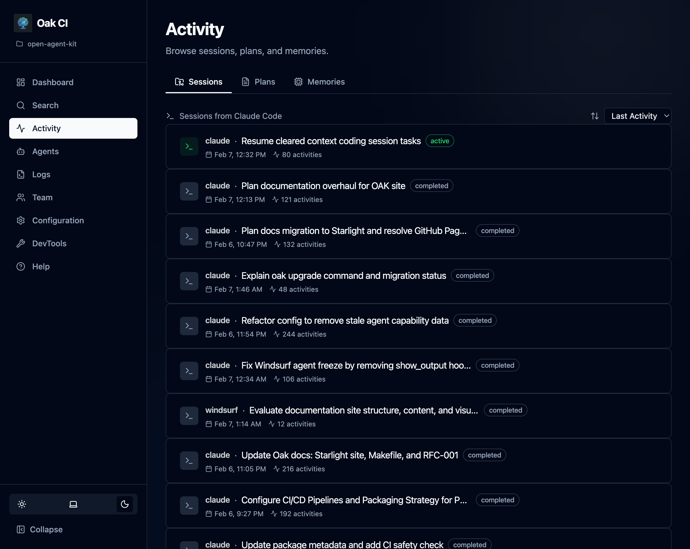
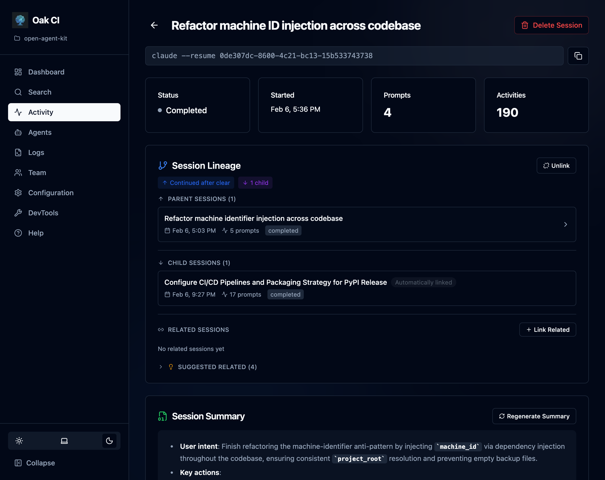
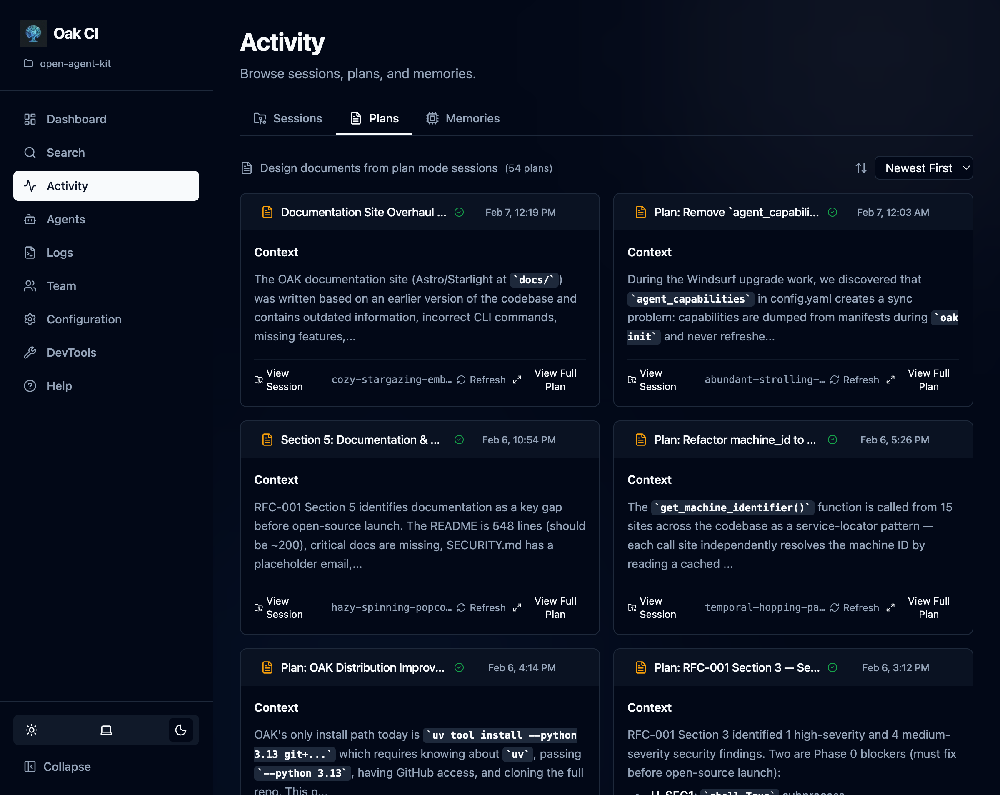
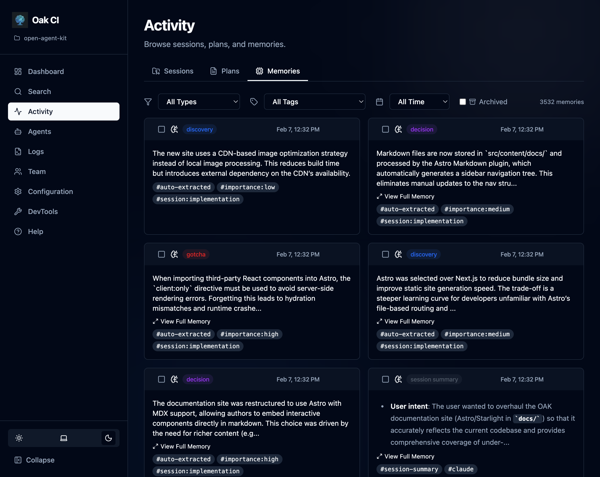

The **Activities** page is the hub for everything your AI agents have done. It's organized into three tabs: Sessions, Plans, and Memories.

## Sessions

Every interaction with an AI coding agent is tracked as a session. The sessions list shows:

- **Title and status** — Auto-generated titles with status badges (active, completed, stale)
- **Activity count** — How many tool executions, prompts, and outputs were captured
- **Agent** — Which coding agent (Claude, Cursor, Codex, etc.) created the session
- **Timestamps** — When the session started and was last active

### Session Detail

Click into any session to see its full timeline:

- **Prompt batches** — Each user prompt and the agent's response, with classification labels
- **Tool executions** — Individual tool calls (file reads, writes, searches, etc.) with timing
- **Session lineage** — Parent-child relationships when sessions spawn sub-agents or compact/resume cycles
- **Related sessions** — Sessions working on similar tasks, detected automatically or linked manually

### Session Actions

- **Complete** — Manually mark a session as completed
- **Regenerate summary** — Re-run the LLM summarizer on a session
- **Link/unlink parent** — Manage session lineage relationships
- **Delete** — Remove a session and all its data (cascading)

## Plans

Browse implementation plans captured during agent sessions. Plans are detected from plan mode files (`.claude/plans/`, `.cursor/plans/`, etc.) and stored alongside the session that created them.

- **Plan list** — All captured plans with title, associated session, and timestamp
- **Rendered markdown** — Click into a plan to see its full content rendered as markdown
- **Refresh from source** — If the plan file still exists on disk, refresh to pick up any changes

## Memories

View, search, and manage all stored observations across your project.

### Filtering

- **By type** — Filter by memory type: `gotcha`, `bug_fix`, `decision`, `discovery`, `trade_off`, `session_summary`
- **By status** — Filter by lifecycle status: `active` (default), `resolved`, `superseded`. By default, only active observations are shown.
- **By tags** — Filter by user-assigned tags for organization

### Memory Actions

- **Resolve** — Mark an observation as resolved when the issue it describes has been addressed. Resolved observations are hidden from default search results but preserved for historical context. Agents can also resolve observations via the `oak_resolve_memory` MCP tool.
- **Archive / Unarchive** — Soft-hide a memory from the active list. Archived memories are preserved in the database and can be restored at any time. This is not a delete — it's a way to reduce noise while keeping the data safe.
- **Delete** — Permanently remove a memory
- **Bulk actions** — Select multiple memories for batch delete, archive, resolve, or tag management

:::tip
Most observations are resolved automatically. When a new observation supersedes an older one on the same topic, OAK marks the older one as `superseded` automatically using semantic similarity matching. See [Memory — Auto-Resolve](/open-agent-kit/features/codebase-intelligence/memory/#auto-resolve-automatic-supersession) for details.
:::
