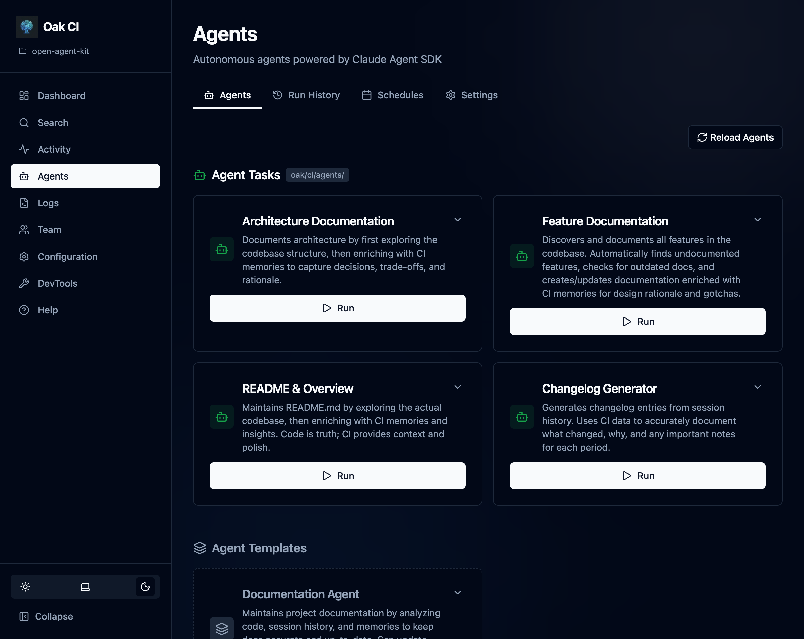

OAK doesn't just capture your development story — it acts on it. **OAK Agents** are autonomous AI agents that use everything CI has learned about your project to perform real work: generating documentation enriched with actual decisions and gotchas, surfacing insights from session history, and keeping your project artifacts in sync with how your codebase actually evolved.

They are distinct from external coding agents (Claude Code, Cursor, Codex, etc.) — those are documented in [Coding Agents](/open-agent-kit/agents/).

## Why OAK Agents Matter

Traditional documentation and analysis tools work from code alone. OAK Agents work from the *full development record* — plans, decisions, trade-offs, gotchas, session history, and semantic code search. The result is documentation that explains *why*, not just *what*, and insights grounded in how your team actually builds software.

Each agent has:

- **Built-in tasks** — Pre-configured work items that ship inside the OAK package (not copied into your project)
- **Custom task support** — Create your own tasks in `oak/agents/` (git-tracked, shareable with your team)
- **Scheduling** — Run tasks automatically on a cron schedule
- **Run history** — Every run is logged with status, output, files modified, and token usage

## Available Agents

| Agent | Purpose | Built-in Tasks |
|-------|---------|---------------|
| **[Documentation Agent](/open-agent-kit/features/codebase-intelligence/documentation-agent/)** | Maintains project documentation using the full CI knowledge base | Root Documentation, Feature Docs, Changelog, Architecture Docs |
| **[Analysis Agent](/open-agent-kit/features/codebase-intelligence/analysis-agent/)** | Turns CI data into actionable insights about productivity, costs, and codebase health | Usage & Cost Report, Productivity Analysis, Codebase Activity, Prompt Quality |
| **[Engineering Agent](/open-agent-kit/features/codebase-intelligence/engineering-agent/)** | An engineering team with role-based tasks for code review, implementation, and issue triage | Senior Engineer, Product Manager |
| **[Maintenance Agent](/open-agent-kit/features/codebase-intelligence/maintenance-agent/)** | Keeps OAK's memory store healthy — consolidates duplicates, resolves stale observations, and maintains data hygiene | Memory Consolidation, Data Hygiene |

## Provider Configuration

OAK Agents use the LLM provider configured in the **Agents page → Settings** tab (`/agents/settings`). This is separate from the summarization model — you may want a more capable model for agent tasks.

Supported providers:

| Provider | Type | Notes |
|----------|------|-------|
| **Claude Code (Default)** | Cloud | Uses your logged-in Claude Code subscription on this machine (no API key needed). |
| **Ollama** | Local | Experimental for agent execution. Requires v0.14.0+ and a capable local model. |
| **LM Studio** | Local | Experimental for agent execution via local OpenAI-compatible endpoint. |

Test the connection from the Agents Settings tab before running agents.
