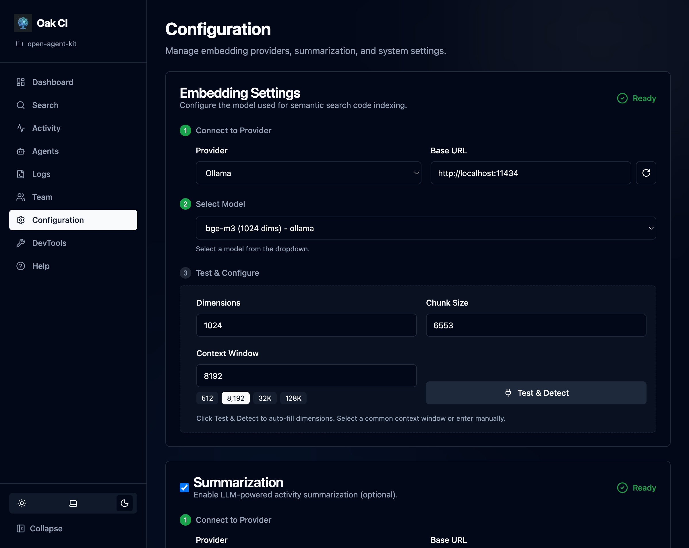

The **Configuration** page is where you set up everything the daemon needs to function at full capability. Models must be configured for embedding and (optionally) summarization before CI can provide semantic search and session summaries.

Open it from the dashboard sidebar, or navigate to `http://localhost:{port}/config`.



## Models

Models are the engine behind CI's semantic search and session summaries. You need at least an **embedding model** for code search. A **summarization model** is optional but highly recommended for session summaries, titles, and memory extraction.

### Providers

OAK supports any local provider with an OpenAI-compatible API:

| Provider | Default URL | Notes |
|----------|-----------|-------|
| **[Ollama](https://ollama.ai)** | `http://localhost:11434` | Most popular choice. Free, easy to set up. |
| **[LM Studio](https://lmstudio.ai)** | `http://localhost:1234` | Desktop app with a visual model browser. |
| **Custom** | Any URL | Any OpenAI-compatible endpoint (vLLM, llama.cpp, etc.) |

**Setup steps:**
1. Select your provider or enter a custom URL
2. The UI fetches available models from the provider
3. Select a model
4. Click **Test & Detect** — OAK auto-detects dimensions and context window
5. Save the configuration

### Embedding Models

Embedding models convert code and text into vectors for semantic search. You need one running before CI can index your codebase.

**Recommended models for Ollama:**

| Model | Dimensions | Context | Size | Pull Command |
|-------|-----------|---------|------|--------------|
| **nomic-embed-text** | 768 | 8K | ~270 MB | `ollama pull nomic-embed-text` |
| **bge-m3** | 1024 | 8K | ~1.2 GB | `ollama pull bge-m3` |
| **nomic-embed-code** | 768 | 8K | ~270 MB | `ollama pull nomic-embed-code` |

:::tip[Which embedding model should I use?]
**Start with `nomic-embed-text`** — it's small, fast, and works well for most codebases. If you need better multilingual support or higher-quality results and have the RAM, try `bge-m3`. For code-heavy projects, `nomic-embed-code` is trained specifically on code.
:::

**For LM Studio:** Search the Discover tab for `nomic-embed-text-v1.5` or `bge-m3` and download.

For the full list of models OAK recognizes, run:
```bash
oak ci config --list-models
```

### Summarization Models

Summarization uses a general-purpose LLM (not an embedding model) to generate session summaries, titles, and extract memory observations. This is a separate configuration from embeddings — you can use different providers or models for each.

**Recommended models for Ollama:**

| Model | Resource Level | Context | Size | Pull Command |
|-------|---------------|---------|------|--------------|
| **gemma3:4b** | Low (8 GB RAM) | 8K | ~3 GB | `ollama pull gemma3:4b` |
| **gpt-oss:20b** | Medium (16 GB RAM) | 32K | ~12 GB | `ollama pull gpt-oss:20b` |
| **qwen3:8b** | Medium (16 GB RAM) | 32K | ~5 GB | `ollama pull qwen3:8b` |
| **qwen3-coder:30b** | High (32+ GB RAM) | 32K | ~18 GB | `ollama pull qwen3-coder:30b` |

:::tip[Which summarization model should I use?]
**For most machines, `gemma3:4b` or `qwen3:8b` are good starting points.** Summarization quality scales with model capability — a more powerful model produces better session titles, more accurate summaries, and catches more memory-worthy observations. If you have the hardware, a larger model is worth it. If summaries are slow, drop down a tier.
:::

**For LM Studio:** Search the Discover tab for any of the models above and download. Make sure to start the local server with your chosen model loaded.

To see what summarization models are available from your provider:
```bash
oak ci config --list-sum-models
```

### Context Window Tips

Local models often default to small context windows that limit summarization quality. The context window determines how much of a session the model can "see" at once.

- **Ollama**: Default `num_ctx` is typically 2048 tokens. For better summaries, increase it:
  ```bash
  # Create a Modelfile with larger context
  echo 'FROM gemma3:4b
  PARAMETER num_ctx 8192' > Modelfile
  ollama create gemma3-4b-8k -f Modelfile
  ```
- **LM Studio**: Check the model's context length in the UI settings and increase if needed.

Higher context windows = better summaries, but more memory usage. **8K is a good minimum for summarization.** Models like `qwen3:8b` support up to 32K natively.

You can also auto-detect and set the context window via CLI:
```bash
oak ci config --sum-context auto    # Auto-detect from provider
oak ci config --sum-context 8192    # Set explicitly
oak ci config --sum-context show    # Show current setting
```

### External Resources

- [Ollama Model Library](https://ollama.ai/library) — Browse all available models
- [Ollama Embedding Models](https://ollama.ai/search?c=embedding) — Filter for embedding-specific models
- [LM Studio](https://lmstudio.ai) — Desktop app for browsing and running local models
- [llama.cpp](https://github.com/ggml-org/llama.cpp) — High-performance C++ inference engine; use its OpenAI-compatible server as a custom provider
- [MTEB Leaderboard](https://huggingface.co/spaces/mteb/leaderboard) — Benchmark for comparing embedding model quality

## Backup Settings

Configure automatic backups and related policies from the Teams page or via the configuration file. See [Teams — Automatic Backups](/open-agent-kit/features/codebase-intelligence/teams/#automatic-backups) for the full guide.

| Setting | Config Key | Default | Description |
|---------|-----------|---------|-------------|
| Automatic backups | `backup.auto_enabled` | `false` | Enable periodic automatic backups |
| Include activities | `backup.include_activities` | `true` | Include the activities table in backups |
| Backup interval | `backup.interval_minutes` | `30` | Minutes between automatic backups (5–1440) |
| Backup before upgrade | `backup.on_upgrade` | `true` | Create a backup before `oak upgrade` |

Backup settings are per-machine (stored in `.oak/config.{machine_id}.yaml`), except `on_upgrade` which is project-level (stored in `.oak/config.yaml`).

```yaml
# Per-machine backup settings
codebase_intelligence:
  backup:
    auto_enabled: true
    include_activities: true
    interval_minutes: 30
```

```yaml
# Project-level backup settings (in .oak/config.yaml)
codebase_intelligence:
  backup:
    on_upgrade: true
```

## Session Quality

Control when background jobs process sessions:

| Setting | Description | Default |
|---------|-------------|---------|
| **min_activities** | Minimum activity count before a session qualifies for background processing | Varies |
| **stale_timeout** | How long (in seconds) an inactive session sits before cleanup | Varies |

- **Higher `min_activities`** = only substantial sessions get summarized (reduces noise)
- **Lower `stale_timeout`** = sessions are cleaned up faster (more responsive, but may cut off sessions that pause briefly)

## Logging

Configure log rotation to manage disk usage:

| Setting | Description |
|---------|-------------|
| **Max file size** | Maximum size of each log file before rotation |
| **Backup count** | Number of rotated log files to keep |

See the [Logs](/open-agent-kit/features/codebase-intelligence/logs/) page for details on viewing and filtering logs.

## CLI Command For Managed Integrations

CI-managed hooks, MCP registrations, and notify handlers use a configurable executable command.
By default this is `oak`.

This is a project-level command alias for managed integrations.
Use it when you want one repository to run OAK through a different executable
while other repositories keep using the default `oak`.

```bash
# Show current setting
oak ci config --show

# Use oak-dev for CI-managed integrations in this project
oak ci config --cli-command oak-dev
```

Common use cases:
- Avoid command-name conflicts with another local tool named `oak`
- Keep a dev executable (`oak-dev`) in one repository while using stable `oak` everywhere else
- Standardize wrappers (for example, team-specific launcher commands) on a single project

After this change, OAK refreshes managed integrations so future hook/MCP/notify executions use the configured command.

## Directory Exclusions

Control which directories are skipped during codebase indexing.

### Built-in Exclusions

OAK includes sensible defaults out of the box:
- `.git`, `node_modules`, `__pycache__`, `.venv`, `venv`
- `dist`, `build`, `.next`, `.nuxt`
- And other common build/dependency directories

OAK also respects your project's `.gitignore` — anything gitignored is automatically excluded from indexing.

### Custom Exclusions

Add your own patterns from the Configuration page. Patterns use glob syntax (e.g., `vendor/**`, `generated/**`). Custom exclusions are saved to the daemon's configuration file.

### Reset to Defaults

If you've added patterns you no longer need, use the **Reset to Defaults** button to restore the built-in exclusion list.

## Governance

Governance settings control what AI agents are allowed to do. Enable rules-based policy enforcement and audit logging from the [Governance](/open-agent-kit/features/codebase-intelligence/governance/) page.

| Setting | Config Key | Default | Description |
|---------|-----------|---------|-------------|
| Enabled | `governance.enabled` | `false` | Whether governance evaluation is active |
| Enforcement mode | `governance.enforcement_mode` | `observe` | `observe` (log only) or `enforce` (can block) |
| Retention days | `governance.retention_days` | `30` | Days to keep audit events (1–365) |

```yaml
codebase_intelligence:
  governance:
    enabled: true
    enforcement_mode: observe
    retention_days: 30
    rules: []  # See Governance docs for rule syntax
```

See the [Governance](/open-agent-kit/features/codebase-intelligence/governance/) page for full documentation on rules, audit logging, and enforcement modes.

## Test & Detect

The **Test & Detect** buttons on the Configuration page let you verify your provider setup:

- **Test connection** — Verifies the provider URL is reachable and the model exists
- **Auto-detect dimensions** — Sends a test embedding to determine the model's vector dimensions
- **Discover context window** — Probes the model to find its maximum context length

This saves you from having to look up model specifications manually.
