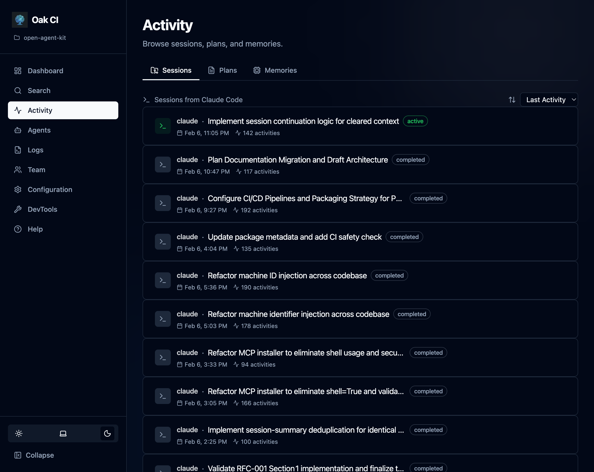

The dashboard is **your primary interface to OAK** after initial setup. It provides a visual interface to everything the daemon tracks — code search, agent activity, project memory, configuration, and more.

**Open the dashboard**: Run `oak ci start --open`, or navigate to `http://localhost:{port}/ui` (use `oak ci port` to find the port).

## Dashboard Home

The home page gives you an at-a-glance view of your project:
- **Files Indexed / Memories / Sessions / Plans** — Key metrics as clickable cards
- **Recent Sessions** — Your latest agent interactions with status indicators
- **System Health** — Embedding provider, summarization model, file watcher status, storage usage, and backup info

## Search

Test and explore semantic search across your entire codebase, memories, and plans.

- **Natural language queries** — Ask questions like "How is authentication handled?" or "Where are database migrations?"
- **Category filters** — Search across All, Code Only, Memories Only, Plans Only, or Sessions Only
- **Confidence levels** — Filter by High, Medium, or Low confidence results
- **Weighted results** — Toggle type-weighted scoring to prioritize the most relevant category

## Activity

Browse and explore your agent's work history.

- **Sessions** — See every agent session with title, status, timestamp, and activity count. Click into a session to see its full timeline of tool calls, prompts, and outputs.
- **Plans** — Browse implementation plans created during agent sessions
- **Memories** — View, search, and manage all stored observations (gotchas, decisions, bug fixes, discoveries)

## Agents

View and manage connected AI agents, including their hook configurations and status.

## Logs

View daemon logs in real time, with support for multiple log files (daemon log, hooks log).

## Team

Manage backups and sharing:
- **Backup & Restore** — Create backups of your project's intelligence data. Backups are stored in `oak/ci/history/` and can be committed to git for team sharing.
- **Sharing** — Share session details with teammates via tunnel URLs.

## Configuration

Manage all settings visually — no need to edit config files or run CLI commands.

- **Embedding Settings** — Choose provider (Ollama, LM Studio, OpenAI-compatible), select model, test connection, and auto-detect dimensions
- **Summarization** — Enable/disable LLM-powered session summaries, configure provider and model
- **Session Quality** — Set thresholds for minimum activities and stale timeout
- **Logging** — Configure log rotation (max file size, backup count)
- **Directory Exclusions** — Add/remove patterns to skip during indexing

## DevTools

Power-user tools for debugging and maintenance:
- **Rebuild Index** — Force a complete wipe and rebuild of the code index
- **Processing Reset** — Clear processed state to force re-summarization
- **Rebuild Memories** — Re-embed all memories from SQLite to ChromaDB

## Help

The dashboard includes built-in contextual help pages covering common tasks and troubleshooting. These help pages complement this documentation site:

- **Dashboard Help** — Task-oriented guides ("how do I change my embedding model?", "how do I share a session?")
- **This docs site** — Conceptual deep-dives, architecture, developer API reference, and the full CLI reference

:::tip
If you're looking for a quick how-to, check the dashboard's Help page first. For understanding *how things work under the hood*, use this docs site.
:::
