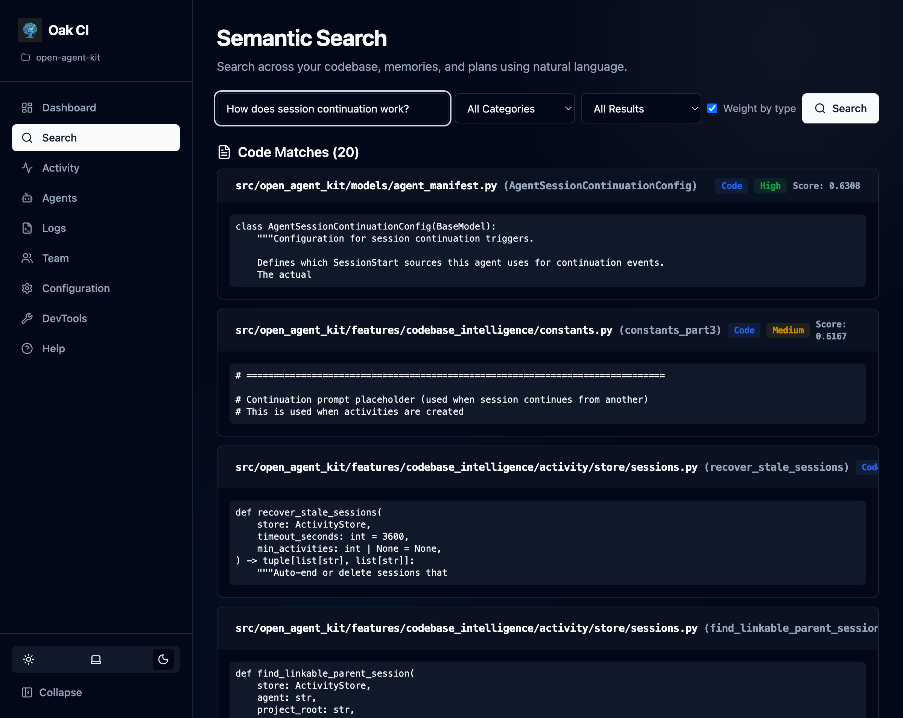

The dashboard is **your primary interface to OAK** after initial setup. It provides a visual interface to everything the daemon tracks — code search, agent activity, project memory, configuration, and more.

**Open the dashboard**: Run `oak ci start --open`, or navigate to `http://localhost:{port}/ui` (use `oak ci port` to find the port).

## Dashboard Home

The home page gives you an at-a-glance view of your project:
- **Files Indexed / Memories / Sessions / Plans** — Key metrics as clickable cards
- **Recent Sessions** — Your latest agent interactions with status indicators
- **System Health** — Embedding provider, summarization model, file watcher status, storage usage, and backup info

## Search

Test and explore semantic search across your entire codebase, memories, and plans.

- **Natural language queries** — Ask questions like "How is authentication handled?" or "Where are database migrations?"
- **Category filters** — Search across All, Code Only, Memories Only, Plans Only, or Sessions Only
- **Confidence levels** — Filter by High, Medium, or Low confidence results
- **Weighted results** — Toggle type-weighted scoring to prioritize the most relevant category

## Feature Pages

Each major dashboard feature has its own dedicated page in the sidebar. Here's a quick overview of what's available:

| Page | What it does |
|------|-------------|
| **[Activities](/open-agent-kit/features/codebase-intelligence/activities/)** | Browse sessions, plans, and memories with filtering and bulk actions |
| **[OAK Agents](/open-agent-kit/features/codebase-intelligence/agents/)** | View built-in agents, run tasks, create custom tasks |
| **[Logs](/open-agent-kit/features/codebase-intelligence/logs/)** | Live log viewer for daemon and hooks activity |
| **[Teams](/open-agent-kit/features/codebase-intelligence/teams/)** | Backup, restore, sync, and share with teammates |
| **[Configuration](/open-agent-kit/features/codebase-intelligence/configuration/)** | Models, session quality, logging, exclusions |
| **[Governance](/open-agent-kit/features/codebase-intelligence/governance/)** | Rules, audit logging, and enforcement for agent tool calls |
| **[DevTools](/open-agent-kit/features/codebase-intelligence/devtools/)** | Stats, maintenance, index rebuilds, cleanup |

## UI Features

- **Update banner** — When the installed OAK version doesn't match the running daemon, a banner appears with version details and a one-click **Restart** button to apply the update
- **Light/dark mode** — Toggle between themes using the sun/moon icon
- **Collapsible sidebar** — Collapse the navigation sidebar to maximize content area
- **Built-in Help** — Click **Help** in the sidebar for task-oriented guides

:::tip
If you're looking for a quick how-to, check the dashboard's Help page first. For understanding *how things work under the hood*, use this docs site.
:::
