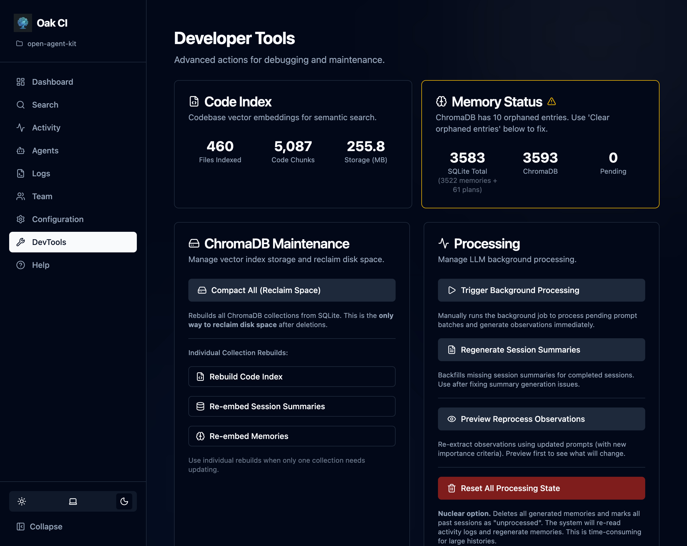

The **DevTools** page provides power-user capabilities for managing the Codebase Intelligence backend. Open it from the sidebar in the [Dashboard](/open-agent-kit/features/codebase-intelligence/dashboard/).



## Stats at a Glance

The top of the DevTools page shows sync status between your two data stores:

| Metric | Description |
|--------|-------------|
| **SQLite chunks** | Total code chunks in the source-of-truth database |
| **ChromaDB chunks** | Total vectors in the search index |
| **Sync status** | Whether SQLite and ChromaDB counts match |
| **Memory count** | Total stored observations |
| **Orphan detection** | Vectors in ChromaDB with no matching SQLite record |

When SQLite and ChromaDB are out of sync, the stats highlight the discrepancy so you know a rebuild is needed.

## Maintenance Tasks

### Rebuild Index

Triggers a full wipe and rebuild of the codebase index (vector store). This **does not delete memories** — only code chunks are re-indexed.

Use this when:
- Files have been renamed or moved and search results feel stale
- You changed the AST parser configuration
- The index was corrupted

### Reset Processing

Resets the "processed" flags for sessions, prompt batches, and activities. This allows background workers to pick them up again — useful if you've changed the summarization model and want to re-summarize past sessions.

Options:
- **Delete memories** — Also removes generated memory observations, allowing them to be regenerated from raw session data

### Reprocess Observations

Re-runs the observation extraction pipeline on prompt batches that have already been processed. Useful after improving the extraction prompts or switching to a better LLM.

Supports **dry-run mode** — preview which batches would be reprocessed without actually doing it.

### Compact ChromaDB

Deletes and rebuilds the entire ChromaDB collection. This is a more thorough version of Rebuild Index that also handles orphaned vectors and stale embeddings.

### Database Maintenance

Runs SQLite and ChromaDB housekeeping:
- **VACUUM** — Reclaims disk space from deleted records
- **ANALYZE** — Updates query planner statistics
- **FTS optimize** — Rebuilds full-text search indexes
- **Integrity check** — Verifies database consistency

### Regenerate Summaries

Re-generates missing session summaries. Useful after restoring from a backup that didn't include summaries, or after switching summarization models.

### Cleanup Minimal Sessions

Removes low-quality sessions that have too few activities to be useful. Helps keep the session list clean and focused on meaningful work.

### Trigger Processing

Manually kicks the background worker loop for immediate processing without waiting for the scheduled interval.

### Rebuild Memories

Re-embeds existing memory text from SQLite into ChromaDB. Use this when:
1. You switched embedding providers (to match the vector space of the new model)
2. The vector store was corrupted or deleted, but the SQLite data is intact

## CLI Shortcuts

A few DevTools actions are also available from the terminal:

```bash
oak ci index --force   # Rebuild the entire code index
oak ci reset           # Reset the entire system (data + index)
```

## When to Use Each Tool

| Situation | Tool |
|-----------|------|
| Search results feel stale | Rebuild Index |
| Changed embedding model | Rebuild Memories |
| Changed summarization model | Reset Processing → Trigger Processing |
| Database seems large | Database Maintenance (VACUUM) |
| ChromaDB out of sync | Compact ChromaDB |
| Missing session summaries | Regenerate Summaries |
| Too many trivial sessions | Cleanup Minimal Sessions |
| Want to re-extract observations | Reprocess Observations (use dry-run first) |
