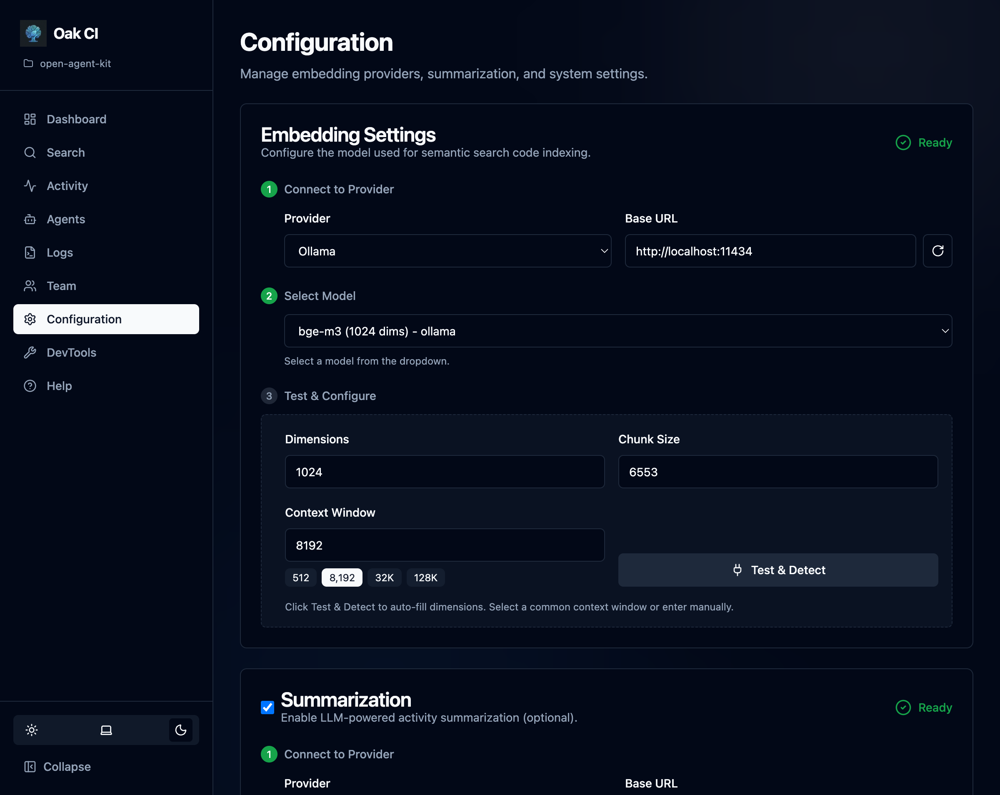

## Prerequisites

- **Open Agent Kit** installed (`pipx install oak-ci`)
- **Ollama** (Recommended for local embeddings) OR any OpenAI-compatible embedding service

## Activation

Run `oak init` in your project directory:

```bash
oak init
```

The interactive setup walks you through two screens:
1. **Agent selection** — Choose which AI coding agents to configure (Claude, Cursor, Gemini, etc.)
2. **Language selection** — Choose which programming languages to install AST parsers for

**What this does automatically:**
- Installs the CI daemon and CLI tools
- Installs AST parsers (tree-sitter) for the selected languages
- Configures **Agent Hooks** for supported agents
- Registers **MCP Servers** for agents that support it
- Updates **IDE Settings** (VSCode/Cursor) for optimal integration

:::tip
`oak init` is idempotent — you can re-run it at any time to add agents, languages, or repair your setup.
:::

## Starting the Daemon

The CI feature runs as a background daemon. Start it and open the dashboard:

```bash
oak ci start --open
```

On the first run, the daemon will:
1. **Scan your codebase** to detect source files
2. **Build the index** — Begin indexing your codebase using the installed parsers (may take a few minutes for large projects)

The dashboard opens automatically in your browser — you can watch indexing progress in real time.

## Configuration

After the daemon starts, **use the dashboard to configure everything**. Open the **[Configuration](/open-agent-kit/features/codebase-intelligence/configuration/)** page from the sidebar to:

- **Choose your embedding provider** — Select from Ollama, LM Studio, or any OpenAI-compatible endpoint. The UI auto-detects available models and dimensions.
- **Enable summarization** — Optionally connect a local LLM for automatic session summaries.
- **Tune session quality** — Control when background jobs process sessions:
  - `min_activities`: minimum activity count before a session qualifies for background processing (prevents summarizing empty or trivial sessions)
  - `stale_timeout`: how long an inactive session sits before cleanup by background maintenance
- **Manage exclusions** — Add directory patterns to skip during indexing (e.g., `dist/**`, `vendor/**`). OAK includes sensible defaults (`.git`, `node_modules`, `__pycache__`, etc.) and respects `.gitignore`.



:::note[Model quality matters]
Higher quality local models produce better summaries. Find the balance between speed and quality that works for your hardware. If using Ollama, consider increasing `num_ctx` beyond the default 2048 — session summaries benefit from larger context windows. The same applies to LM Studio's default context size.
:::

:::tip
The dashboard also has a built-in **Help** page with contextual guidance for each feature. Click **Help** in the sidebar for quick answers.
:::

## Establish Project Rules

Once OAK and your agents are set up, use the **`/project-governance`** skill to create a project constitution — a living document that codifies your team's engineering standards so AI agents follow them consistently.

From any configured agent, run:

```
/project-governance Let's establish our project's constitution
```

The agent will:
1. Analyze your codebase for existing patterns (testing, linting, CI/CD, project structure)
2. Check for existing agent instruction files (`CLAUDE.md`, `AGENTS.md`, `.cursorrules`, etc.) and use them as context
3. Create `oak/constitution.md` with standards tailored to your project
4. Update agent instruction files to reference the constitution (additively — your existing rules are preserved)

This works in both **greenfield** projects (no existing rules) and **brownfield** projects (existing conventions that should be formalized).

:::tip[Recommended for all projects]
A constitution dramatically improves agent consistency. Without one, agents may invent patterns, use conflicting conventions across sessions, or ignore established team standards. Even a minimal constitution with your tech stack, quality gate, and a few anchor files makes a significant difference.
:::

As your project evolves, use the same skill to amend the constitution when new rules are discovered:

```
/project-governance Let's ensure we always follow the vertical slice architectural pattern
```

After updating the constitution, sync the changes to all agent instruction files:

```bash
oak rules sync-agents
```

See the [Skills](/open-agent-kit/agents/skills/#project-governance) page for the full `/project-governance` reference.

## Verify Installation

Open the dashboard home page to verify everything is working:

- **Files Indexed**: Shows the number of source files tracked
- **Memories**: Count of stored observations
- **Sessions**: Agent sessions being tracked
- **System Health**: Embedding and summarization provider status

You can also check from the terminal:

```bash
oak ci status
```
