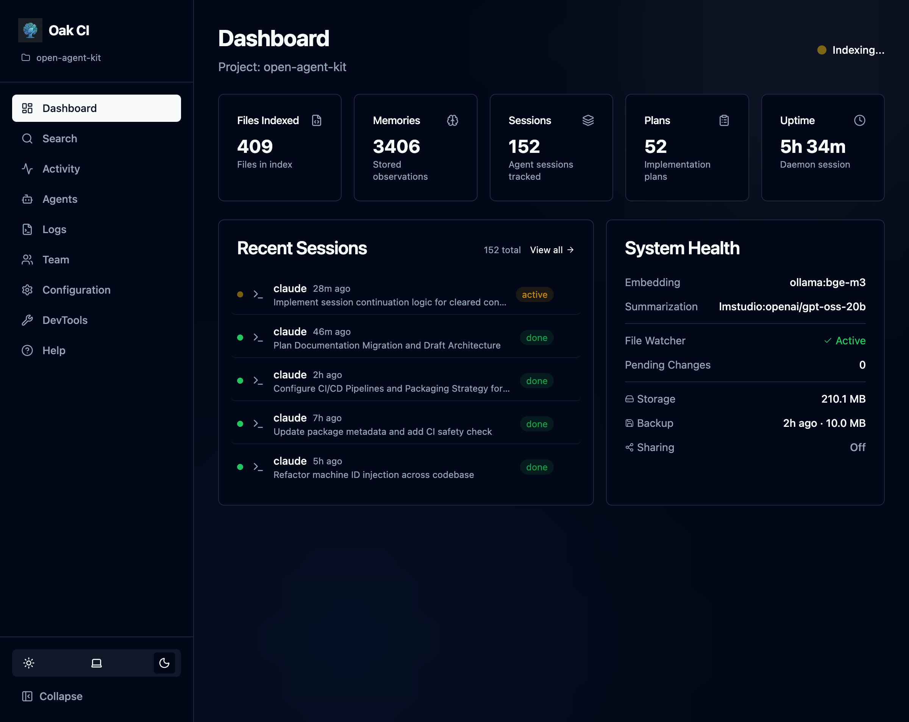
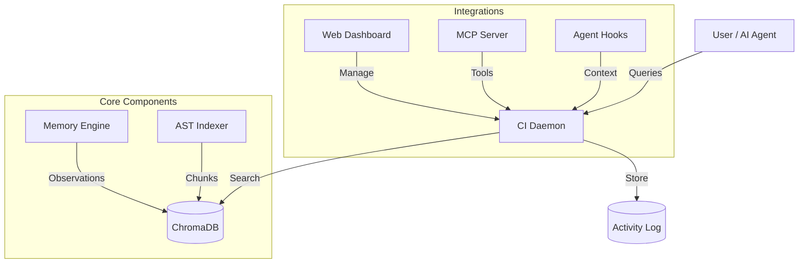

**Codebase Intelligence (CI)** is the "sight" and "memory" layer for your AI agents. It transforms your codebase into a semantic knowledge graph that agents like Claude, Codex, and Cursor can query to understand not just *what* code does, but *why* it exists.

## The Problem

Standard context retrieval (RAG) often fails for complex coding tasks because:
1. **It's Amnesic**: It doesn't remember past decisions, bugs, or architectural constraints.
2. **It's Shallow**: It treats code as text, missing the structural relationships between symbols.
3. **It's Passive**: It waits for you to ask, rather than proactively warning you about "gotchas".

## The OAK Solution

Codebase Intelligence runs as a lightweight local daemon that provides:

### 1. Persistent Memory
CI remembers your project's history. When you or your agents solve a problem, CI records it as a "memory observation".
- **Gotchas**: "The auth module requires Redis to be running."
- **Decisions**: "We chose SQLite over Postgres for simplicity."
- **Patterns**: "Always use the `Result` type for error handling."

These memories are automatically injected into future agent sessions when relevant, preventing regressive bugs and circular conversations.

### 2. Semantic Code Search
The daemon maintains a real-time vector index of your codebase using AST-aware chunking (via tree-sitter). This allows agents to find code by *concept* rather than just keyword.
- *User*: "Where is the authentication middleware?"
- *Agent*: Finds `src/middleware/auth.ts` even if the file is named differently, based on its semantic function.

### 3. Live Agent Hooks
CI integrates directly with your agent's workflow.
- **Pre-Prompt**: Injects relevant context and memories before the agent starts working.
- **Post-Tool**: Analyzes the agent's actions (like `Edit` or `Bash` commands) to auto-capture new learnings.
- **Session End**: Summarizes the entire coding session to refine the project's long-term memory.

### 4. Agent Skills
OAK actively extends your agent's capabilities through **Skills**.
- **User-Invocable Skills**: Skills you can ask the agent to perform (e.g., "Create an RFC for this feature").
- **Background Skills**: Capabilities the agent uses autonomously (e.g., finding related code patterns).

## The Dashboard

After setup, **the [Dashboard](/open-agent-kit/features/codebase-intelligence/dashboard/) is your primary interface**. Use it to search your codebase, browse agent sessions, manage memories, configure settings, and more — all from your browser.

## Architecture

## Supported Agents

| Agent | Context Injection | Activity Capture | Integration Method |
|-------|-------------------|------------------|--------------------|
| **Claude Code** | Session + Prompt + Post-tool | Yes | `settings.json` hooks |
| **Gemini CLI** | Session + Prompt + Post-tool | Yes | `settings.json` hooks |
| **Cursor** | Session + Prompt + Post-tool | Yes | `.cursor/hooks.json` |
| **OpenCode** | Session + Prompt + Post-tool | Yes | TypeScript plugin (`oak-ci.ts`) |
| **Windsurf** | Prompt only | Yes | `.windsurf/hooks.json` |
| **Codex CLI** | Via OpenTelemetry | Yes | OTLP log events & Notify |
| **GitHub Copilot** | None (cloud-only hooks) | No | `.github/hooks/hooks.json` |

**Context injection** is what makes CI proactive — it automatically surfaces relevant memories and code search results into your agent's context. Agents with **Session + Prompt + Post-tool** injection get the richest experience: context at session start, before each prompt, and after file operations. Agents with **Prompt only** receive context before each prompt but not at session start.

:::note[GitHub Copilot limitations]
Copilot's hooks run in the cloud, not locally. Since OAK's daemon runs on your machine, Copilot hooks cannot reach it. Copilot still gets skills and commands, but no context injection or activity capture until local hook support is added.
:::
