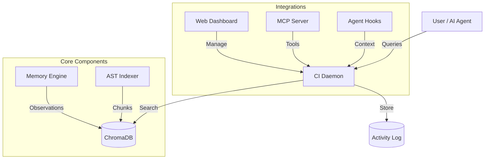

**Codebase Intelligence (CI)** captures the complete development story behind AI-written code. Every plan, decision, gotcha, and trade-off is recorded as your agents work — creating a semantically rich history that goes far beyond what git blame or commit messages could ever tell you.

## The Problem

When AI agents build your software, the most valuable part of the process isn't the code — it's the *reasoning*. Why was this approach chosen over alternatives? What gotchas were discovered? What architectural trade-offs were made? All of that context lives in agent sessions that vanish when the conversation ends.

Git captures *what* changed. OAK captures *why*, *how*, and *what was learned along the way*.

## How CI Works

Codebase Intelligence runs as a lightweight local daemon that provides four interconnected capabilities:

### 1. The Development Record
CI automatically captures the full lifecycle of every agent session — prompts, tool executions, plans, AI summaries, and outcomes. In the background, an LLM classifies these activities and extracts observations: gotchas, decisions, discoveries, bug fixes, and trade-offs. These become your project's persistent memory.

- **Gotchas**: "The auth module requires Redis to be running."
- **Decisions**: "We chose SQLite over Postgres for simplicity."
- **Trade-offs**: "Sacrificed write throughput for read latency in the caching layer."

This is the development context that no one writes down but everyone wishes they had six months later.

### 2. Semantic Code Search
The daemon maintains a real-time vector index of your codebase using AST-aware chunking (via tree-sitter across 13 languages). Agents find code by *concept* rather than keyword — "where is the authentication middleware?" finds the right file even if it's named differently, based on its semantic function.

### 3. Proactive Context Injection
CI doesn't wait for you to ask. It integrates directly with your agent's workflow through hooks:
- **Session Start**: Injects project context and relevant memories before the agent begins.
- **Pre-Prompt**: Surfaces related code and past learnings before each prompt.
- **Post-Tool**: Analyzes file operations to provide file-specific memories and capture new activities.
- **Session End**: Summarizes the entire session and extracts observations for long-term memory.

The result: agents that remember what your team has learned, across every session and every engineer.

### 4. Agent Skills
OAK extends your agent's capabilities through [Skills](/open-agent-kit/agents/skills/) — slash commands that leverage CI's knowledge base for tasks like finding related code, analyzing change impacts, creating RFCs, and establishing project standards.

## The Dashboard

After setup, **the [Dashboard](/open-agent-kit/features/codebase-intelligence/dashboard/) is your primary interface**. Use it to search your codebase, browse agent sessions, manage memories, configure settings, and more — all from your browser.

## Architecture

## Supported Agents

| Agent | Context Injection | Activity Capture | Integration Method |
|-------|-------------------|------------------|--------------------|
| **Claude Code** | Session + Prompt + Post-tool | Yes | `settings.json` hooks |
| **Gemini CLI** | Session + Prompt + Post-tool | Yes | `settings.json` hooks |
| **Cursor** | Session + Prompt + Post-tool | Yes | `.cursor/hooks.json` |
| **OpenCode** | Session + Prompt + Post-tool | Yes | TypeScript plugin (`oak-ci.ts`) |
| **Windsurf** | Prompt only | Yes | `.windsurf/hooks.json` |
| **Codex CLI** | Via OpenTelemetry | Yes | OTLP log events & Notify |
| **GitHub Copilot** | None (cloud-only hooks) | No | `.github/hooks/hooks.json` |

**Context injection** is what makes CI proactive — it automatically surfaces relevant memories and code search results into your agent's context. Agents with **Session + Prompt + Post-tool** injection get the richest experience: context at session start, before each prompt, and after file operations. Agents with **Prompt only** receive context before each prompt but not at session start.

:::note[GitHub Copilot limitations]
Copilot's hooks run in the cloud, not locally. Since OAK's daemon runs on your machine, Copilot hooks cannot reach it. Copilot still gets skills and commands, but no context injection or activity capture until local hook support is added.
:::
