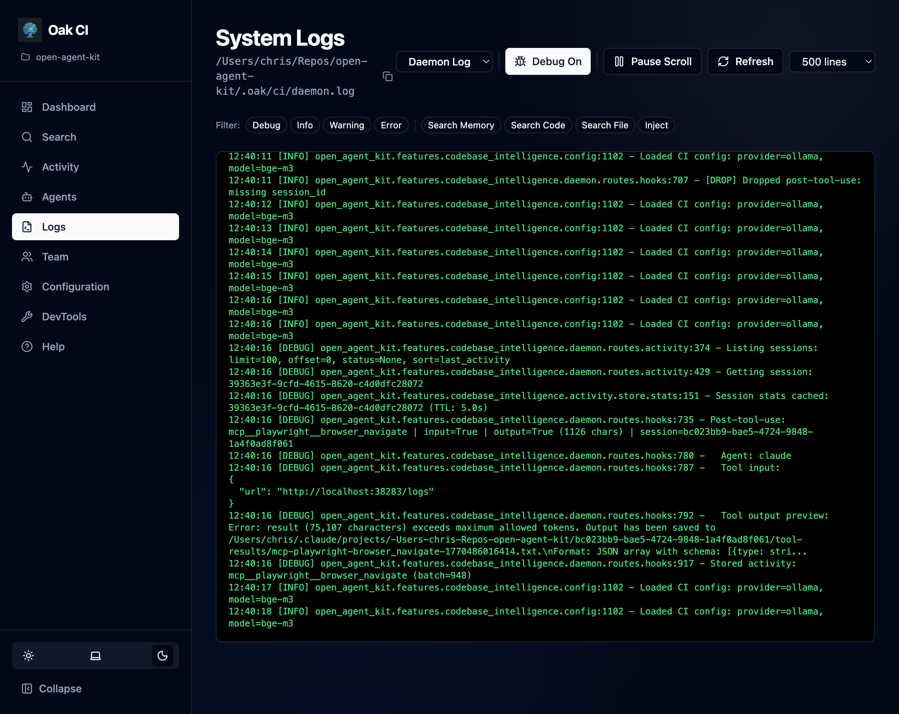
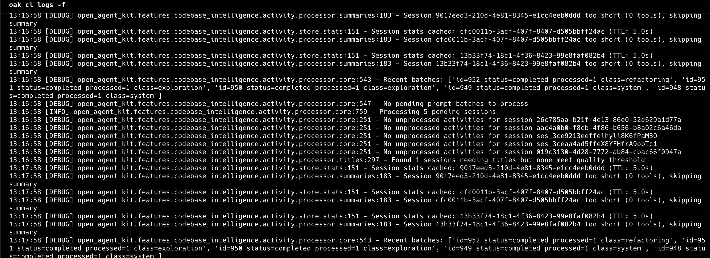

The **Logs** page provides a comprehensive log viewer for verifying daemon behavior and debugging issues.

## Log Files

OAK maintains two separate log files:

| Log | Purpose |
|-----|---------|
| **Daemon log** | Main server activity — indexing, background jobs, API requests, errors |
| **Hooks log** | Agent activity tracking — session starts, prompt captures, tool executions, session completions |

Switch between logs using the tabs at the top of the page.



## Features

### Live Scrolling

Logs stream in real time as the daemon works. Auto-scroll keeps you at the bottom to see the latest entries. When you scroll up to inspect an older entry, auto-scroll pauses so you can read and copy without the view jumping away.

### Tag Filters

Log entries are tagged by category (e.g., `indexer`, `hooks`, `background`, `search`, `config`). Use the tag chips at the top of the log viewer to filter entries:

- Click a tag to show only entries with that tag
- Select multiple tags for OR-logic filtering (shows entries matching any selected tag)
- Click again to deselect

### Debug Mode

Toggle the **Debug** switch to enable `DEBUG` level logging. This restarts the daemon with verbose output — useful for diagnosing issues with embedding providers, background processing, or hook execution.

:::note
Debug mode produces significantly more log output. Turn it off when you're done troubleshooting.
:::

### Line Limits

Configure how many log lines to display (100–5000) to balance between history and performance.

## CLI Alternative

You can also follow logs from the terminal:

```bash
oak ci logs -f          # Follow daemon logs
```


