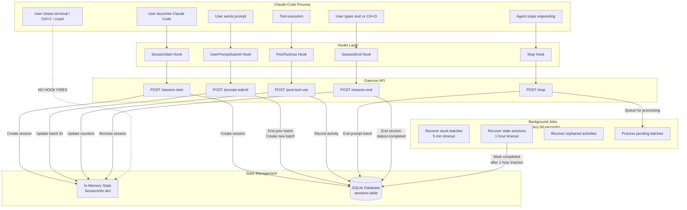
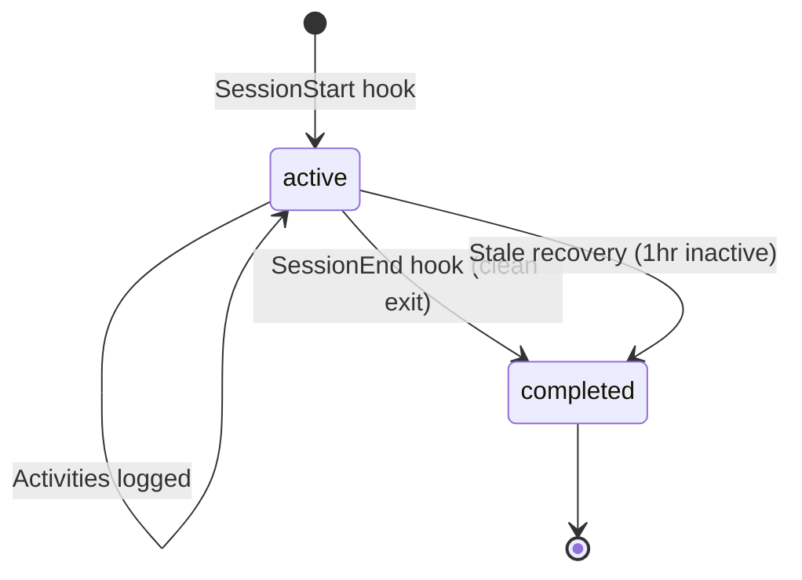

Sessions track all activity within an agent invocation. While the diagrams reference Claude Code, the same lifecycle applies to Cursor and Gemini via equivalent hook events.

## Lifecycle Diagram



## Session States



## Hook Events

| Hook | When Fired | What We Do | Notes |
|------|------------|------------|-------|
| `SessionStart` | Agent launches | Create session in memory + DB, inject context | Includes `source`: startup, resume, clear, compact |
| `UserPromptSubmit` | User sends a prompt | End previous batch, create new batch, search context | Creates prompt batches for grouping activities |
| `PostToolUse` | After each tool runs | Record activity to DB, update counters | Liberal capture for LLM processing |
| `Stop` | Agent finishes responding | End current prompt batch, queue for processing | Triggers async observation extraction |
| `SessionEnd` | Clean exit (/exit, Ctrl+D) | End session, generate summary | May not fire on unclean exits |

## Background Jobs

All jobs run every 60 seconds:

### 1. Recover Stuck Batches
- **Timeout**: 5 minutes
- **Condition**: Prompt batch with `status='active'` and no activity for 5+ minutes
- **Action**: Mark batch as `status='completed'`

### 2. Recover Stale Sessions
- **Timeout**: 1 hour
- **Condition**: Session with `status='active'` and no recent activity
- **Action**: Mark session as `status='completed'`
- **Purpose**: Handles unclean exits where SessionEnd never fires

### 3. Recover Orphaned Activities
- **Condition**: Activities with `prompt_batch_id = NULL`
- **Action**: Associate with most recent batch or create recovery batch

### 4. Process Pending Batches
- **Condition**: Completed batches not yet processed
- **Action**: Send to LLM for observation extraction, store to ChromaDB

## Session Start Behavior

When a new session starts:

1. **We do NOT close other active sessions** — multiple concurrent sessions are valid (multiple terminal windows)
2. **We create a new session** with unique UUID
3. **If same session_id provided** (e.g., daemon restart), we resume the existing session
4. **Context is injected** based on `source` parameter:
   - `startup`: Full context (memories, stats)
   - `resume`: Minimal context
   - `clear`/`compact`: Varies

## Configuration

Key constants:

```python
SESSION_INACTIVE_TIMEOUT_SECONDS = 3600  # 1 hour
BATCH_ACTIVE_TIMEOUT_SECONDS = 300       # 5 minutes
BACKGROUND_PROCESSING_INTERVAL = 60      # seconds
```

## Debugging

```bash
# Check session states
sqlite3 .oak/ci/activities.db \
  "SELECT id, status, started_at, ended_at FROM sessions ORDER BY started_at DESC LIMIT 5;"

# Check daemon logs for lifecycle events
grep -E "Session start|Session end|Recovered" .oak/ci/daemon.log | tail -20

# Force close a session
sqlite3 .oak/ci/activities.db \
  "UPDATE sessions SET status='completed', ended_at=datetime('now') WHERE id='SESSION_ID';"
```
