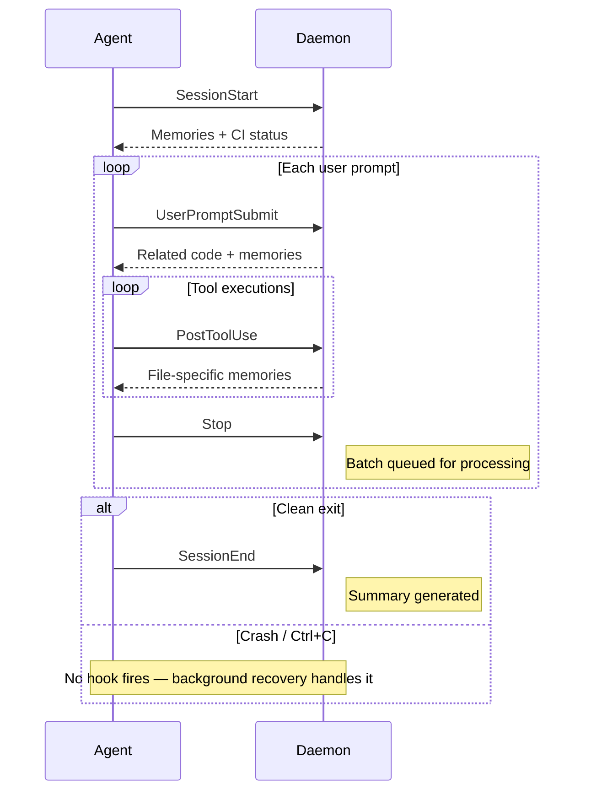
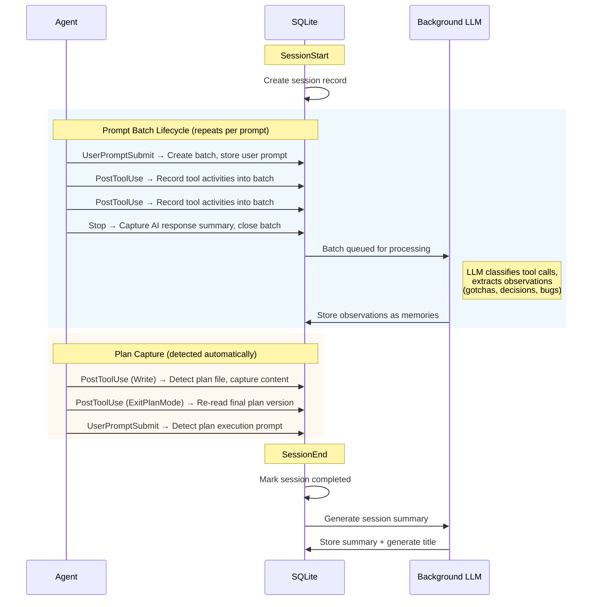
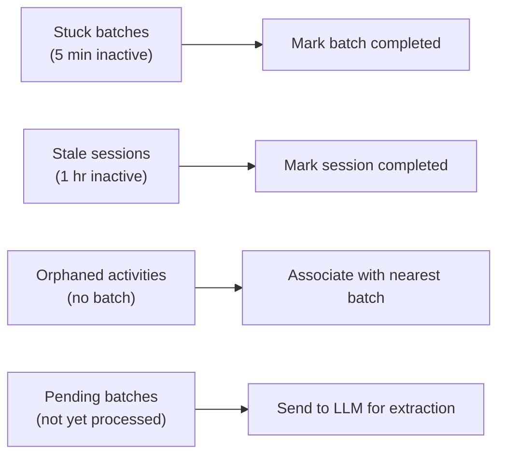
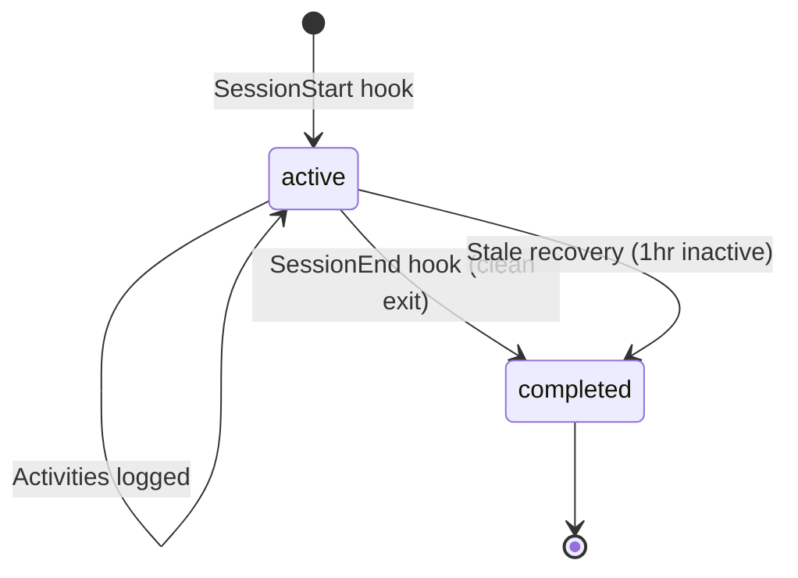

Sessions track all activity within an agent invocation. While the diagrams reference Claude Code, the same lifecycle applies to Cursor and Gemini via equivalent hook events.

## Lifecycle Overview

A session flows through three layers: the **agent** fires hook events, the **daemon API** processes them, and **background jobs** handle recovery when things don't exit cleanly.

### Hook Flow

Hooks are **bidirectional** — the agent sends events to the daemon, and for key events the daemon sends context back that gets injected into the agent's working context. This is how CI proactively surfaces relevant memories and code.



Dashed arrows show context flowing **back** to the agent. Not all agents support this — see [Supported Agents](/open-agent-kit/features/codebase-intelligence/#supported-agents) for which agents get context injection.

### Data Flow

What the daemon persists at each stage. The core unit is the **prompt batch** — each user prompt creates a batch that collects all tool activity and the AI's response until the agent stops.



**What gets stored in each prompt batch:**
- **User prompt** — the text the user typed
- **Tool activities** — every Read, Edit, Write, Bash, etc. with inputs and outputs
- **AI response summary** — captured from the agent's transcript when `Stop` fires

**Background observation extraction** is the key to CI's persistent memory. While the coding session is still running, completed prompt batches are sent to a local LLM that:
1. **Classifies** each tool call — was this a routine file read, or something worth remembering?
2. **Extracts observations** — gotchas, decisions, bug fixes, trade-offs, discoveries
3. **Stores them as memories** in SQLite and ChromaDB for injection into future sessions

This happens asynchronously so it never blocks the agent. By the time the session ends, most observations are already extracted.

:::note[SQLite is the source of truth]
All data — sessions, batches, activities, observations — is written to SQLite first. Observations and summaries are then embedded into ChromaDB for fast semantic search. If ChromaDB is ever lost or the embedding model changes, everything can be rebuilt from SQLite via DevTools.
:::

**Plan capture** happens within the normal hook flow — no separate event needed:
- When a **Write** to a plan directory is detected (`.claude/plans/`, `.cursor/plans/`, etc.), the batch is marked as a plan and the content is captured
- When **ExitPlanMode** fires, the plan file is re-read to capture the final approved version (which may differ from the initial write after iteration)
- If the same session writes to the same plan file multiple times, the existing plan batch is updated rather than creating duplicates

### Background Recovery

Every 60 seconds, background jobs clean up sessions that didn't exit cleanly:



## Session States



## Hook Events

| Hook | When Fired | What We Store | What We Inject Back | Notes |
|------|------------|---------------|--------------------|----|
| `SessionStart` | Agent launches | Create session record | Memories + CI status | `source` field: startup, resume, clear, compact |
| `UserPromptSubmit` | User sends a prompt | Create prompt batch, store user prompt | Related code + memories | Also detects plan execution prompts |
| `PostToolUse` | After each tool runs | Record activity into current batch | File-specific memories (Read/Edit/Write) | Also detects plan file writes + ExitPlanMode |
| `Stop` | Agent finishes responding | Capture AI response summary, close batch | — | Batch queued for background LLM observation extraction |
| `SessionEnd` | Clean exit (/exit, Ctrl+D) | Mark session completed | — | Triggers async session summary + title generation. May not fire on crash. |

## Background Jobs

All jobs run every 60 seconds:

### 1. Recover Stuck Batches
- **Timeout**: 5 minutes
- **Condition**: Prompt batch with `status='active'` and no activity for 5+ minutes
- **Action**: Mark batch as `status='completed'`

### 2. Recover Stale Sessions
- **Timeout**: 1 hour
- **Condition**: Session with `status='active'` and no recent activity
- **Action**: Mark session as `status='completed'`
- **Purpose**: Handles unclean exits where SessionEnd never fires

### 3. Recover Orphaned Activities
- **Condition**: Activities with `prompt_batch_id = NULL`
- **Action**: Associate with most recent batch or create recovery batch

### 4. Process Pending Batches
- **Condition**: Completed batches not yet processed
- **Action**: Send to LLM for observation extraction, store to ChromaDB

## Session Start Behavior

When a new session starts:

1. **We do NOT close other active sessions** — multiple concurrent sessions are valid (multiple terminal windows)
2. **We create a new session** with unique UUID
3. **If same session_id provided** (e.g., daemon restart), we resume the existing session
4. **Context is injected** based on `source` parameter:
   - `startup`: Full context (memories, stats)
   - `resume`: Minimal context
   - `clear`/`compact`: Varies

## Configuration

Key constants:

```python
SESSION_INACTIVE_TIMEOUT_SECONDS = 3600  # 1 hour
BATCH_ACTIVE_TIMEOUT_SECONDS = 300       # 5 minutes
BACKGROUND_PROCESSING_INTERVAL = 60      # seconds
```

## Debugging

### Using the `/querying-oak-databases` skill

The recommended way to inspect session data is with the `/querying-oak-databases` agent skill. It provides the current database schema and ready-to-use queries, so you don't need to discover table names or column types yourself — especially useful as the schema evolves across releases.

Ask your agent:
```
/querying-oak-databases show me recent sessions and their statuses
```

### Manual queries

If you prefer raw SQL, the database lives at `.oak/ci/activities.db`:

```bash
# Check session states
sqlite3 .oak/ci/activities.db \
  "SELECT id, status, started_at, ended_at FROM sessions ORDER BY started_at DESC LIMIT 5;"

# Check daemon logs for lifecycle events
grep -E "Session start|Session end|Recovered" .oak/ci/daemon.log | tail -20
```

:::caution[Schema may change]
The SQLite schema evolves between releases. Prefer the `/querying-oak-databases` skill for accurate, up-to-date queries.
:::
