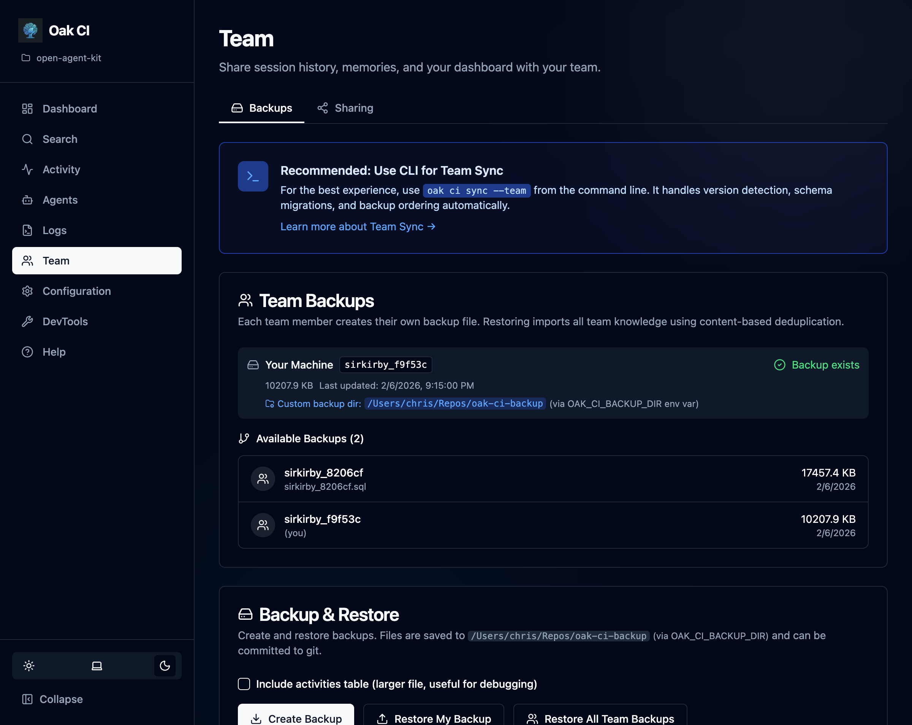
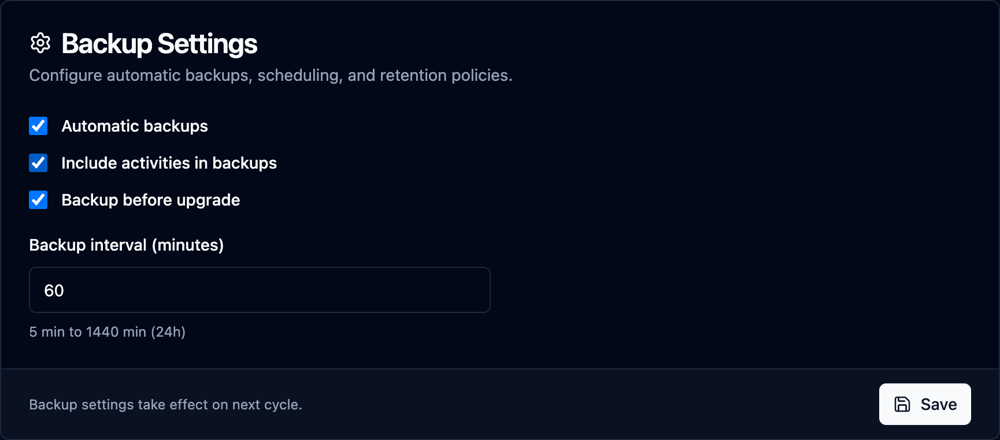
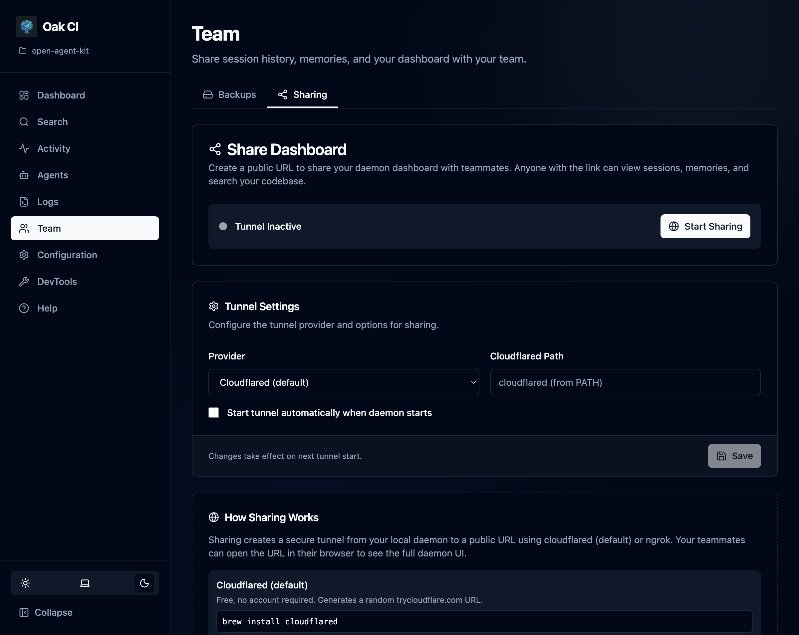

The **Teams** page manages how you preserve and share Codebase Intelligence data across machines and developers.

## Team Backups

Each machine produces its own backup file named `{github_user}_{hash}.sql`, stored in `oak/history/` (git-tracked by default). This means every developer on the team has their own backup alongside the source code.



### What Gets Backed Up

| Data | Included | Notes |
|------|----------|-------|
| Sessions | Always | Full session metadata including parent/child links |
| Prompt batches | Always | User prompts, classifications, plan content |
| Memories | Always | All observations (gotchas, decisions, bug fixes, etc.) |
| Activities | Configurable | Raw tool execution logs — can be large. Controlled by backup settings or `--include-activities` flag |

### Backup Location

The default backup directory is `oak/history/` inside your project. This is designed to be committed to git so backups travel with the codebase.

To use an alternative location (e.g., a secure network share):
- Set the `OAK_CI_BACKUP_DIR` environment variable, or
- Add it to your project's `.env` file

### Deduplication

Backups use content-based hashing for cross-machine deduplication:

| Table | Hash Based On |
|-------|---------------|
| sessions | Primary key (session ID) |
| prompt_batches | session_id + prompt_number |
| memory_observations | observation + type + context |
| activities | session_id + timestamp + tool_name |

Multiple developers' backups can be merged without duplicates.

## Automatic Backups

The daemon can create backups automatically on a configurable schedule. This ensures your CI data is always preserved without manual intervention.



### Enabling Automatic Backups

Automatic backups are **disabled by default**. Enable them from the **Backup Settings** card on the Teams page, or via the configuration file:

```yaml
# In .oak/config.{machine_id}.yaml
codebase_intelligence:
  backup:
    auto_enabled: true
    interval_minutes: 30
```

### Settings

| Setting | Default | Description |
|---------|---------|-------------|
| **Automatic backups** | Off | Enable periodic automatic backups |
| **Include activities** | On | Include the activities table in backups (larger files) |
| **Backup before upgrade** | On | Automatically create a backup before `oak upgrade` runs |
| **Backup interval** | 30 min | How often automatic backups run (5 min to 24 hours) |

The backup interval field appears when automatic backups are enabled. Changes take effect on the next backup cycle.

### How It Works

- The daemon runs a background loop that checks the interval and creates backups automatically
- Each automatic backup replaces the previous one for your machine (one file per machine)
- The "Include activities" setting applies to both automatic and manual backups when no explicit flag is given
- The CLI `--include-activities` flag overrides the configured default

### Pre-Upgrade Backups

When **Backup before upgrade** is enabled (the default), running `oak upgrade` automatically creates a backup before applying any changes. This provides a safety net in case an upgrade modifies the database schema.

## Backup & Restore

### Creating Backups

```bash
oak ci backup                        # Standard backup (uses configured defaults)
oak ci backup --include-activities   # Include raw activities (overrides config)
oak ci backup --list                 # List available backups
```

Or use the **Create Backup** button on the Teams page in the dashboard.

### Restoring

Restore your own backup or any team member's backup:

```bash
oak ci restore                                        # Restore your own backup
oak ci restore --file oak/history/teammate_a7b3c2.sql   # Restore a teammate's backup
```

After restore, ChromaDB is automatically rebuilt in the background to re-embed all memories with the current embedding model.

### Schema Evolution

- **Older backup → newer schema**: Missing columns use SQLite defaults (usually NULL). Works automatically.
- **Newer backup → older schema**: Extra columns are stripped during import. A warning is logged but import proceeds. No data loss for columns that exist in both schemas.

## Team Sync (`oak ci sync`)

The recommended way for teams to stay in sync. This single command handles the full workflow:

```bash
oak ci sync              # Standard sync
oak ci sync --full       # Rebuild index from scratch
oak ci sync --team       # Merge all team backups
oak ci sync --dry-run    # Preview without applying changes
```

### What sync does

1. **Stop daemon** — Ensures clean state for data operations
2. **Restore backups** — Applies your personal backup
3. **Start daemon** — Brings the daemon back up
4. **Run migrations** — Applies any schema changes from upgrades
5. **Create fresh backup** — Saves current state

### Flags

| Flag | Description |
|------|-------------|
| `--full` | Rebuild the entire code index from scratch |
| `--team` | Also merge all team member backups from `oak/history/` |
| `--include-activities` | Include the activities table in backup (larger file) |
| `--dry-run` | Preview what would happen without applying changes |

:::tip
Run `oak ci sync --team` after pulling from git to pick up your teammates' latest backups.
:::

## Sharing

Share your local daemon instance with teammates using tunnels. This gives them read access to your dashboard, search, and session data — useful for pair programming or code review.



### Tunnel Support

OAK supports Cloudflare and ngrok tunnels:

```bash
oak ci tunnel-start      # Start a tunnel
oak ci tunnel-stop       # Stop the tunnel
oak ci tunnel-status     # Check tunnel status
oak ci tunnel-url        # Get the shareable URL
```

### Auto-Start

Configure tunnels to start automatically with the daemon by setting `tunnel.auto_start` in the configuration.

### Use Cases

- **Single developer, multiple machines**: Keep your CI data in sync across work and personal machines
- **Team code review**: Share a session with a teammate so they can see exactly what the agent did
- **Future**: Lays groundwork for shared OAK instances where a team runs a single daemon

:::note[CORS restrictions]
The daemon only allows connections from localhost and active tunnel URLs. External origins are blocked by the CORS middleware.
:::
